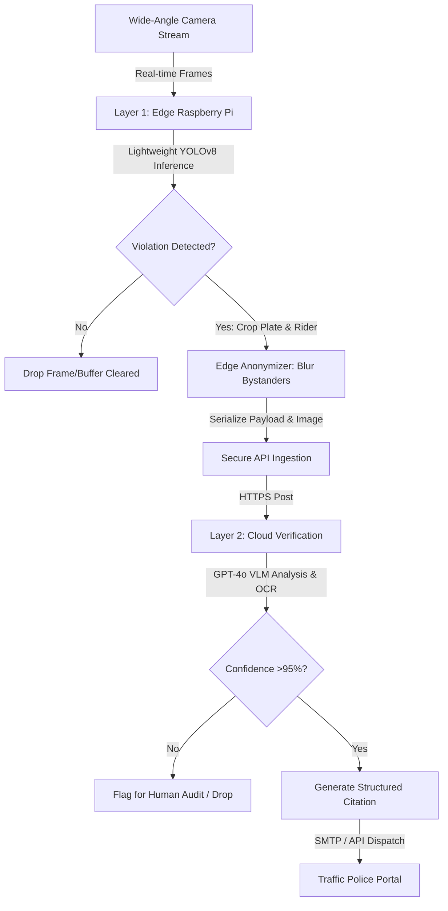

# Document 01: Executive Summary

---

## 1. Executive Summary

**Hawk-AI** is an open-source, crowdsourced traffic violation detection ecosystem that bridges the gap between civic responsibility and municipal law enforcement. By combining lightweight edge computing (computer vision on Raspberry Pi) with advanced cloud intelligence (Vision-Language Models), Hawk-AI provides a hands-free, automated, and privacy-respecting mechanism for vehicle commuters to report traffic infractions. 

The project aims to make city streets safer by empowering citizens to collect verifiable, geo-tagged, and automated evidence of critical violations—such as riding without helmets, wrong-way driving, and road divider jumping. 

---

## 2. Problem Statement

### 2.1 The Crisis of Casual Traffic Violations in High-Density Cities
In rapid-growth, high-density urban areas like Bengaluru, India, traffic congestion is compounded by a chronic culture of casual traffic violations. According to statistics from the Bengaluru Traffic Police (BTP), millions of citations are issued annually, yet these represent only a fraction of actual infractions. Common violations like wrong-way riding, riding without helmets, and jumping road dividers are frequent causes of severe accidents and road rage, turning commuting into a high-risk activity.

### 2.2 Bandwidth Constraints of Law Enforcement
Traditional traffic monitoring relies on:
1. **Static Speed and Red-Light Cameras**: Highly expensive to install and maintain, limited to major intersections, and easily bypassed by motorists who know their locations.
2. **On-Ground Traffic Officers**: Physically limited by human fatigue, safety risks, and staffing shortages. Officers cannot be present on every narrow road, flyover exit, or neighborhood street where violations are most rampant.

### 2.3 The Dangers of Manual Reporting
While civic-minded citizens want to report violations (e.g., using official city traffic portals or apps like Bengaluru's "Public Eye"), doing so manually while driving or riding a motorcycle is extremely hazardous. Pulling out a smartphone to photograph a violating vehicle:
* Distracts the driver, increasing the chance of an accident.
* Requires manual cropping, data entry, and uploading, which commuters rarely have time for.
* Often results in blurry, unusable images lacking metadata (location, time) required for legal action.

---

## 3. Proposed Solution

Hawk-AI introduces a **two-layer edge-to-cloud AI pipeline** that automates the entire process, removing the driver from the reporting loop.

### 3.1 Layer 1: Local Edge Inference (Raspberry Pi & YOLO)
Mounted on a helmet or dashboard, a wide-angle camera feeds video to a Raspberry Pi. 
* **Model**: A customized, quantized **YOLOv8-nano** model trained specifically on Indian/dense-traffic vehicle profiles and rider positions.
* **Function**: Runs local inference on the live video stream (15 FPS). It continuously monitors for bounding boxes containing traffic violations (e.g., a motorcycle without a helmet, a vehicle traveling opposite to the GPS-defined traffic vector).
* **Filtering**: If no violation is detected, the frame is instantly deleted, preserving privacy and local storage. If a violation is suspected, the Pi crops the region of interest (ROI), runs an edge-side blurring routine on non-violating plates and faces, and packages the image along with high-precision GPS coordinate data and timestamps.

### 3.2 Layer 2: Cloud Validation (Vision-Language Model reasoning)
The edge device uploads the compressed, metadata-tagged payload to the Hawk-AI cloud server via cellular network (or syncs it post-ride).
* **Model**: **OpenAI GPT-4o** (Vision-Language Model).
* **Function**: GPT-4o analyzes the cropped image and coordinates. Using chain-of-thought prompting, the VLM verifies the infraction:
  * *Is there a visible violation?* (e.g., "Confirm if the rider in the yellow shirt is riding without a helmet").
  * *OCR Extraction*: Extracts the exact license plate alphanumeric text from the cropped vehicle image.
  * *Confidence Scoring*: Computes a confidence score for the violation.
* **Dispatch**: If the confidence score exceeds **95%**, the system automatically generates a structured JSON report and dispatches a citation email/API payload directly to municipal traffic authorities.

---

## 4. Business Value

Hawk-AI creates a self-sustaining cycle of traffic enforcement that benefits all stakeholders:

| Stakeholder | Business & Social Value |
| :--- | :--- |
| **Municipalities & Police** | **Exponential Force Multiplier**: Thousands of commuting cameras act as virtual police officers. Creates a massive, decentralized enforcement network at zero infrastructure capital expenditure for the city. Increases citation revenue while reducing on-street police safety hazards. |
| **Everyday Commuters** | **Safer Streets**: Motorists are deterred from casual violations knowing any surrounding rider could be running a Hawk-AI device. Drivers can safely and effortlessly contribute to city safety without putting themselves in danger or stopping their commute. |
| **Insurance Companies** | **Risk Mitigation**: The data collected can help pinpoint high-risk roads and driving behaviors, allowing insurance firms to refine geographic risk profiling and encourage safer driving habits. |

---

## 5. Key Features

### 5.1 Automated Riding Without a Helmet Detection
The edge model detects motorcycles and extracts the bounding boxes of the rider and pillion. It runs head-pose and helmet-detection subclassifiers to identify instances where the rider or passenger is riding bareheaded.

### 5.2 Automated Wrong-Way Driving Detection
By comparing the vehicle's heading vector (calculated from sequential bounding boxes) against the GPS sensor heading and OpenStreetMap direction vectors, the system flags vehicles driving against the flow of traffic.

### 5.3 Automated Jumping Road Dividers Detection
Detects vehicles traversing, mounting, or crossing non-designated road medians, dividers, and pedestrian pathways.

### 5.4 Automated Edge-Side Anonymization
Protects public privacy by identifying faces of pedestrians and license plates of vehicles NOT involved in the violation and blurring them locally on the Raspberry Pi before cloud ingestion.

### 5.5 Automatic Plate OCR & Citation Generation
The cloud VLM performs high-accuracy OCR on the violating license plate, structures the timestamp and GPS location into a human-readable street address, compiles the evidence photo, and drafts/mails a standard PDF infraction citation directly to the traffic authority endpoint.
