# Document 02: Business Requirements Document (BRD)

---

## 1. Business Objectives

The primary objective of **Hawk-AI** is to build a scalable, decentralized traffic violation reporting ecosystem that improves road safety. The business aims to:
1. **Reduce Violations**: Decrease critical traffic violations (wrong-way riding, helmet infractions, median-jumping) in pilot cities by 30% within 12 months of deployment.
2. **Minimize Municipal Overhead**: Reduce the time and cost required for traffic authorities to process citizen-submitted complaints by automating evidence validation.
3. **Establish Citizen-Led Enforcement**: Provide a safe, passive, and legal mechanism for commuters to participate in civic governance.
4. **Build an Open-Source Standard**: Foster a developer ecosystem around civic technology, enabling global adaptation of the core models and hardware designs.

---

## 2. Stakeholders

| Stakeholder Group | Description | Key Interests / Requirements |
| :--- | :--- | :--- |
| **Data Contributors (Commuters)** | Everyday motorists who mount the camera and edge device. | Zero cognitive load while riding; privacy protection; device stability; zero battery drain on their vehicles. |
| **Municipal Traffic Authorities** | Local traffic police and transit administration officers. | High-quality, legally viable evidence; **zero false positives** to prevent public disputes; structured data formats that plug into existing ticketing software. |
| **Ecosystem Developers** | Open-source contributors, hardware engineers, and ML researchers. | Modular codebase; clean APIs; accessible datasets (anonymized) to train and improve detection models. |
| **Civic Society & Public** | Pedestrians, residents, and general commuters. | Assurance that their privacy is not violated by rolling cameras; safer roads; accountability for dangerous drivers. |

---

## 3. Scope of the System

### 3.1 In-Scope
* **Local Violation Detection**: Real-time inference of three core infractions (helmet, wrong-way, dividers) on low-power edge units.
* **Offline Buffering**: local storage of evidence payloads during internet dropouts, and automatic syncing when connection is re-established.
* **VLM Cloud Validation**: Intelligent filtering using advanced multi-modal models to double-check infractions and perform license plate OCR.
* **Dynamic Blurring**: Edge-side anonymization of uninvolved vehicles and pedestrians.
* **Authority Dispatch Engine**: Auto-generation of standardized citation reports with GPS coordinates, timestamps, and cropped evidence photos, delivered via SMTP or REST APIs.

### 3.2 Out-of-Scope
* **Fining & Payment Gateway**: Processing traffic ticket payments is strictly the responsibility of the municipal government.
* **Real-time Video Streaming**: The edge device does not stream live video to the cloud, reducing bandwidth costs and preventing centralized surveillance.
* **Speed Violation Tracking**: Speed calculation requires certified, calibrated radar/lidar hardware; camera-based speed estimation is out of scope due to local legal regulations.

---

## 4. Success Criteria

To ensure municipal acceptance and public trust, the project operates under strict quality thresholds:

```mermaid
gantt
    title Success Criteria Targets
    dateFormat  X
    axisFormat %s
    section Accuracy
    Edge Detection Recall (YOLO) :active, 0, 70
    Cloud Verification Precision (VLM) :crit, 0, 95
    False Positive Dispatches to Police :0, 0
    section Performance
    Edge Inference Latency :active, 0, 60
    Cloud API Roundtrip Time :0, 80
```

1. **Zero False Positives Sent to Police (Target: 0%)**: No citation must be forwarded to the police portal unless the cloud VLM returns a verification confidence rating of **>95%**. In borderline cases, the system routes the ticket to a human-in-the-loop (HITL) moderator dashboard.
2. **System Latency**: Edge inference must maintain at least **12-15 FPS** on a Raspberry Pi 4 to ensure vehicle license plates do not pass out of the camera's field of view before capture.
3. **Data Completeness**: 100% of forwarded reports must contain high-accuracy GPS coordinates, UTC timestamps, a cropped plate image, and the verified plate text.

---

## 5. Risks and Constraints

### 5.1 Legal Frameworks on Citizen-Submitted Evidence
* **Risk**: Many jurisdictions do not legally recognize automated citizen-submitted dashcam video as sole grounds for issuing traffic fines.
* **Mitigation**: Hawk-AI structures the reports as "Civic Advisories" or official complaints submitted under the citizen's behalf. The traffic police portal acts as the final arbiter, where a police officer reviews the verified evidence pack and signs the ticket, satisfying the legal requirement of human officer verification.

### 5.2 User Privacy and GDPR/DPDP Compliance
* **Risk**: Continuous public recording violates data protection regulations (like EU's GDPR or India's Digital Personal Data Protection Act - DPDP) if unmanaged.
* **Mitigation**: 
  * The system performs **Edge-Side Blurring** of all faces and license plates except for the violating vehicle.
  * No raw video footage is stored permanently. Frames that do not contain a violation are kept in volatile RAM buffers and overwritten within 5 seconds.
  * Only compressed, anonymous crop images containing the infraction are sent to the cloud.

### 5.3 Thermal Throttling of Edge Devices
* **Risk**: Commuters may place the edge processing unit (Raspberry Pi) inside backpacks, pockets, or sealed bike pouches. The lack of active airflow combined with heavy YOLOv8 CPU/GPU inference will cause the device to thermal-throttle (slowing down inference to <2 FPS) or shut down completely.
* **Mitigation**: The custom RPi casing must incorporate passive heat sinks and dual 5V cooling fans. The edge software will monitor the core temperature via `/sys/class/thermal/thermal_zone0/temp` and dynamically drop frames or scale down resolution if the temperature exceeds **75°C**.

### 5.4 High-Vibration Camera Feeds
* **Risk**: Helmet-mounted cameras and motorcycle handlebars experience high-frequency vibrations and rapid head movements. This causes motion blur, rolling shutter distortion, and misaligned bounding boxes, leading to missed detections.
* **Mitigation**: 
  * Use cameras with hardware-based Electronic Image Stabilization (EIS).
  * The edge preprocessing script uses OpenCV's Laplacian variance method to calculate frame sharpness, discarding heavily blurred frames immediately to conserve CPU cycles.
