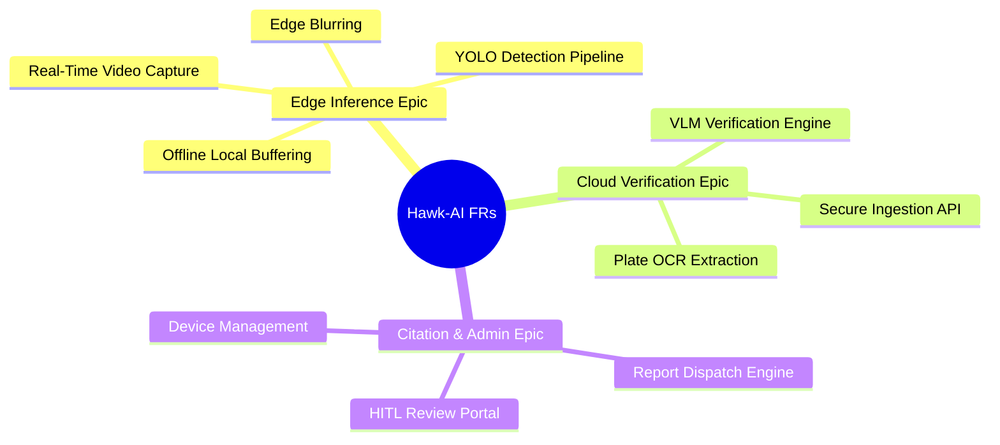

# Document 03: Product Requirements Document (PRD)

---

## 1. Product Vision
To build the world's most reliable, community-driven, privacy-preserving traffic safety network that transforms ordinary commutes into proactive shields against traffic lawlessness, utilizing edge intelligence to protect privacy and cloud reasoning to ensure absolute accountability.

---

## 2. User Personas

### 2.1 Persona 1: Amit Kumar - The Crowdsourcing Commuter
* **Profile**: 28-year-old software engineer living in Bengaluru. Commutes 15km daily on a motorcycle.
* **Goals**: Wants a safer commute; wants a hands-free way to report dangerous drivers without stopping or risking his safety.
* **Pain Points**: Frustrated by wrong-way riders and divider-jumpers who block traffic. Concerned about his own personal data privacy and hates complex tech setups.

### 2.2 Persona 2: Officer Shankar Patil - The Reviewing Authority
* **Profile**: 45-year-old Traffic Inspector. Processes civic traffic violations.
* **Goals**: Needs a reliable, fast stream of verified violations that require minimal manual double-checking.
* **Pain Points**: Overwhelmed by low-quality citizen photos that lack clear license plates, exact locations, or legal metadata. Concerned about public backlash over false tickets.

### 2.3 Persona 3: Elena Vance - The Open-Source Contributor
* **Profile**: 24-year-old computer vision student and Linux developer.
* **Goals**: Wants to contribute to civic-tech; wants to adapt Hawk-AI to run on newer hardware like Jetson Nano.
* **Pain Points**: Poorly documented architectures and monolithic, non-customizable codebases.

---

## 3. Functional Requirements

The functional requirements are grouped into three core epics:



### 3.1 Epic 1: Edge Inference & Local Processing
* **FR-1.1**: The system shall ingest live frames from a USB/MIPI wide-angle camera at 1080p resolution.
* **FR-1.2**: The edge device shall perform real-time YOLOv8 object detection to identify helmets, motorcycles, vehicles, and lanes.
* **FR-1.3**: The edge device shall blur all human faces and license plates of vehicles NOT flagged for a violation before serializing data.
* **FR-1.4**: The system shall save violation payloads (compressed cropped image, GPS, speed, heading, timestamp) to a local SQLite database when cellular network is unavailable.
* **FR-1.5**: The system shall automatically synchronize buffered database entries to the cloud once an active internet connection is detected.

### 3.2 Epic 2: Cloud Ingestion & VLM Verification
* **FR-2.1**: The cloud server shall expose a secure REST endpoint for edge payload ingestion.
* **FR-2.2**: The VLM Verification engine shall send the crop image to GPT-4o with structured prompt templates to verify if a violation indeed occurred.
* **FR-2.3**: The VLM shall extract the violating vehicle's license plate characters using multi-pass OCR.
* **FR-2.4**: The VLM shall return a structured JSON response containing: `violation_confirmed` (Boolean), `license_plate` (String), `confidence_score` (Float), and `reasoning` (String).

### 3.3 Epic 3: Citation Dispatch & Review Portal
* **FR-3.1**: The system shall automatically format verified violations into PDF infraction reports.
* **FR-3.2**: The system shall dispatch reports with a confidence score >95% to the municipal traffic police API or SMTP inbox.
* **FR-3.3**: Any report with a confidence score between 75% and 95% shall be routed to the human-in-the-loop (HITL) review dashboard for manual approval.
* **FR-3.4**: The admin portal shall display aggregate spatial metrics (heatmaps of violations, peak infraction hours).

---

## 4. Non-Functional Requirements

### 4.1 Performance & Latency
* **NFR-4.1.1**: The edge detection model must maintain a frame processing latency of under **80ms** per frame (minimum 12 FPS on Raspberry Pi 4).
* **NFR-4.1.2**: The Cloud API ingestion-to-dispatch pipeline must process the entire queue within **5 seconds** per report (excluding manual HITL queue).

### 4.2 Security & Data Privacy
* **NFR-4.2.1**: All API communication between the edge device and cloud must be encrypted via HTTPS (TLS 1.3) using device-unique API keys.
* **NFR-4.2.2**: No unblurred images containing recognizable faces or uninvolved license plates must be stored in the cloud database.

### 4.3 Reliability & Resilience
* **NFR-4.3.1**: The edge SQLite buffer must be able to store up to **2,000 violations** offline without system crashes or data corruption.
* **NFR-4.3.2**: The cloud system must achieve **99.9% availability** to ensure continuous ingest streams.

---

## 5. User Journeys

### 5.1 Commuter User Journey: Passive Recording
1. **Setup**: Amit mounts the Hawk-AI RPi rig to his helmet, connects a power bank, and starts his motorcycle.
2. **Ride**: While riding through a congested intersection, another rider riding without a helmet cuts in front of him.
3. **Capture**: The helmet camera captures the scene. YOLOv8 on the Pi flags the violation, blurs surrounding cars, and caches the crop.
4. **Outage**: Amit passes through an underpass with zero cell connectivity. The Pi saves the event to the SQLite database.
5. **Sync**: As he exits the underpass and network reconnects, the Pi uploads the event in the background. Amit completes his commute without touching his phone once.

### 5.2 Officer User Journey: Resolving Borderline Violations
1. **Login**: Officer Patil logs into the Hawk-AI Web Portal.
2. **Review**: He opens the "Review Queue" which contains violations flagged with 82% confidence (e.g., a rider wearing a cap that looks like a helmet from behind).
3. **Action**: The portal displays the raw crop and GPT-4o's reasoning: *"Rider is wearing a blue baseball cap, not a safety helmet."*
4. **Approval**: Officer Patil clicks "Approve Citation". The system instantly generates the ticket, logs the officer's ID, and dispatches the PDF.

---

## 6. Acceptance Criteria (Gherkin Syntax)

### 6.1 Feature: Helmet-less Rider Detection and Sync
```gherkin
Scenario: Correctly detect and upload helmet violation
  Given the edge camera is running and capturing frames
  When a motorcycle rider passes the frame without a helmet
  Then the YOLOv8 model should detect the vehicle and the bare head
  And the edge anonymizer should blur all bystander faces in the frame
  And the device should successfully POST the serialized crop to the ingestion API
  And the cloud VLM should verify the helmet violation with confidence > 95%
```

### 6.2 Feature: Offline Data Persistence during Network Loss
```gherkin
Scenario: Handle cellular network dropout while riding
  Given the edge device is running
  And cellular network connection is lost
  When the device detects a wrong-way traffic infraction
  Then the device should write the image crop and GPS data to the local SQLite database
  And the system status LED should show orange (Offline Buffer Mode)
  And when the network connection is restored
  Then the device should push all buffered records to the cloud API and clear the local buffer
```
