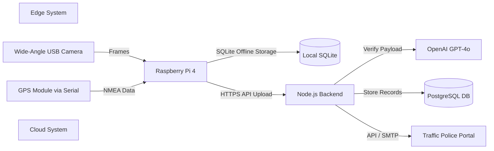

# Document 04: Software Requirements Specification (SRS)
*Conforming to IEEE Std 830-1998*

---

## 1. Introduction

### 1.1 Purpose
This document specifies the software requirements for **Hawk-AI: Open-Source Crowdsourced Traffic Violation Detection Ecosystem**. It outlines the functional and non-functional requirements of the edge client software and the cloud backend systems. It is intended for software developers, hardware integration engineers, and quality assurance testers.

### 1.2 Scope
Hawk-AI is composed of:
1. **Edge Client Core**: Python-based computer vision application running YOLOv8 on Raspberry Pi OS.
2. **Cloud Backend**: Node.js/TypeScript REST API that handles edge telemetry ingestion, manages VLM queries (OpenAI API), and manages the PostgreSQL database.
3. **Admin Web Dashboard**: Web interface for police review and system performance metrics.

### 1.3 Definitions, Acronyms, and Abbreviations
* **VLM**: Vision-Language Model (specifically OpenAI's GPT-4o).
* **YOLO**: You Only Look Once (Ultralytics object detection algorithm).
* **NMEA**: National Marine Electronics Association standard for GPS data telemetry.
* **HITL**: Human-In-The-Loop validation.
* **OTA**: Over-The-Air firmware updates.
* **ROI**: Region of Interest.

---

## 2. Overall Description

### 2.1 Product Perspective
Hawk-AI functions as a hybrid edge-cloud IoT network. The edge node is a self-contained embedded system containing a camera, a GPS receiver, and a processing unit. It relies on the cloud system for high-level semantic reasoning, data storage, and report dispatch.



### 2.2 Product Functions
* Real-time road camera feed analysis.
* Automatic local infraction capture (helmet-less riding, divider crossing, wrong-way).
* Face and non-violating vehicle license plate anonymization.
* Offline data storage during cellular dropouts.
* VLM-based context confirmation and OCR text extraction.
* Structured citation generation and dispatch to police portals.

### 2.3 User Characteristics
* **Riders (Data Contributors)**: Minimal technical skill. Expect "set and forget" hardware operation.
* **Traffic Officers**: Average technical skill. Require intuitive web dashboards to approve or reject citations.
* **System Admins**: High technical skill. Manage system scales, API keys, and server infrastructure.

---

## 3. External Interface Requirements

### 3.1 User Interfaces
* **Web Admin Portal**: Responsive dashboard with user verification, tables of pending violations, detail view of evidence crops, and spatial heatmaps. Built with standard HTML/CSS/JS.
* **Local Web Interface**: Light local server run by the Pi (`http://hawk-ai.local`) to configure Wi-Fi credentials, check GPS lock status, and view storage space.

### 3.2 Hardware Interfaces

#### 3.2.1 Camera Hardware Interface
* **Connection**: USB 2.0 (UVC compliant) or MIPI CSI camera interface.
* **Software Driver**: Linux Video4Linux2 (V4L2) driver framework.
* **Frame Ingestion**: Captured via Python `cv2.VideoCapture` class. Resolving frames at 1920x1080 resolution, MJPEG compression format, 30 FPS.

#### 3.2.2 GPS Sensor Interface
* **Connection**: Serial interface (UART) connected to GPIO Pins 14 (TXD) and 15 (RXD) of the Raspberry Pi.
* **Baud Rate**: 9600 bps.
* **Protocol**: NMEA-0183 standard sentences.
* **Parsing Library**: Python `pynmea2` package. The software must extract:
  * **$GPRMC** sentence: Extract Latitude, Longitude, UTC Time, and Speed Over Ground (converted from knots to km/h).
  * **$GPGGA** sentence: Extract GPS Quality Indicator (must be >0 to confirm a valid 2D/3D lock).

```python
# Reference GPS NMEA Parsing Logic
import serial
import pynmea2

def read_gps_data():
    ser = serial.Serial('/dev/ttyS0', 9600, timeout=1)
    while True:
        data = ser.readline().decode('utf-8', errors='ignore')
        if data.startswith('$GPRMC'):
            msg = pynmea2.parse(data)
            gps_lat = msg.latitude
            gps_lon = msg.longitude
            gps_speed = msg.spd_over_grnd * 1.852 # Knots to km/h
            return gps_lat, gps_lon, gps_speed
```

### 3.3 Software Interfaces

#### 3.3.1 Mail Server / SMTP Interface
* **Protocol**: SMTP over SSL/TLS.
* **Connection Port**: Port 465 (or Port 587 with STARTTLS).
* **Library**: Node.js `nodemailer` module.
* **Function**: Send automated citation emails containing details and attachment PDFs to `citations@municipal-traffic.gov.in`.

#### 3.3.2 Traffic Police API Connection
* **Protocol**: RESTful API over HTTPS.
* **Authentication**: Bearer Token (JWT) in Authorization Header.
* **Payload Format**: JSON payload containing:
  ```json
  {
    "device_uuid": "f47ac10b-58cc-4372-a567-0e02b2c3d479",
    "timestamp": "2026-05-31T04:00:53Z",
    "location": { "lat": 12.9716, "lon": 77.5946 },
    "violation_type": "NO_HELMET",
    "license_plate": "KA03HA1234",
    "evidence_image_url": "https://s3.hawk-ai.ai/evidence/20260531_00123.jpg"
  }
  ```

---

## 4. System Features

### 4.1 System Feature 1: Edge Computer Vision Pipeline
* **Description**: Real-time evaluation of the video frames.
* **Functional Requirements**:
  * **SRS-F-1.1**: The software must instantiate YOLOv8-nano and run local inference on frame blocks.
  * **SRS-F-1.2**: If a violation is suspected, the system must trigger a capture sequence saving the current frame and 3 preceding buffered frames to memory.

### 4.2 System Feature 2: Off-Grid Persistence
* **Description**: Edge operations without cellular network.
* **Functional Requirements**:
  * **SRS-F-2.1**: The system must verify internet connection by attempting a TCP handshake with the backend every 60 seconds.
  * **SRS-F-2.2**: In offline state, reports must be written to the local SQLite database.
  * **SRS-F-2.3**: Upon restoration of connection, the sync sequence must upload reports sequentially using a sliding window rate-limiter to prevent network congestion.
