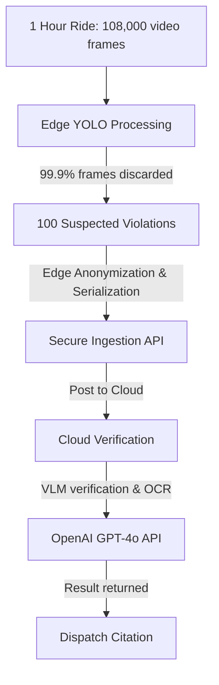

# Document 05: Project Plan

---

## 1. Work Breakdown Structure (WBS)

The project tasks are structured hierarchically:

```text
1. Hawk-AI Project
    1.1 Hardware Assembly & Configuration
        1.1.1 Procurement of Bill of Materials (BOM)
        1.1.2 Soldering GPS and Setup of GPIO UART Serial
        1.1.3 Designing and 3D Printing Protective Case
        1.1.4 Flashing Raspberry Pi OS and Driver Setup
    1.2 Edge Computer Vision Pipeline (Python)
        1.2.1 Training Custom YOLOv8-nano Model for Indian Vehicles
        1.2.2 Implementing OpenCV Frame Grabber & Buffering
        1.2.3 Developing Edge Anonymization Module (Face/Plate Blur)
        1.2.4 Developing SQLite Offline Persistence Manager
    1.3 Cloud Backend Development (Node.js/TypeScript)
        1.3.1 Building Ingestion REST API
        1.3.2 Integrating OpenAI GPT-4o Vision API
        1.3.3 Database Schema Implementation (PostgreSQL/PostGIS)
        1.3.4 Setting up SMTP Citation Dispatch Service
    1.4 Web Administration Portal (HTML/CSS/JS)
        1.4.1 Developing Review Queue and HITL Interface
        1.4.2 Implementing Map View and Spatial Analytics
    1.5 QA, Deployment & DevOps
        1.5.1 CI/CD pipeline setup (GitHub Actions)
        1.5.2 Deploying cloud microservices via Docker
        1.5.3 Conducting Vibration, Thermal, and Network Dropout Tests
```

---

## 2. Project Milestones

| Milestone | Phase / Output | Target Date | Description |
| :--- | :--- | :--- | :--- |
| **M1: Hardware MVP** | Hardware Prototype & Image Feeds | Month 1 | Raspberry Pi boots, captures 1080p video, parses GPS location in real-time. |
| **M2: Edge CV Alpha** | Local Detection & Blurring | Month 2 | Quantized YOLOv8 runs at >12 FPS on Pi. Faces and innocent plates are blurred locally. |
| **M3: Integration Beta** | Ingestion, VLM Engine, DB | Month 3 | SQLite sync works. Backend processes edge payload, GPT-4o verifies and runs OCR, DB records logs. |
| **M4: Public Release** | Admin Portal, Deployment | Month 4 | Cloud backend fully Dockerized. Admin portal displays HITL queue. First end-to-end citation dispatched. |

---

## 3. Agile Sprint Plan

The project execution is organized into four 2-week sprints:

### Sprint 1: Hardware Setup & Edge Vision Skeleton
* **Goal**: Establish functional edge hardware and load the quantized YOLOv8-nano model.
* **Sprint Backlog**:
  * [SPI-101] Connect GPS module to RPi GPIO UART, write NMEA parsing service (3 SP).
  * [SPI-102] Set up camera driver, capture 1080p frames at 30 FPS via OpenCV (2 SP).
  * [SPI-103] Import quantized YOLOv8-nano model, verify inference latency on Pi CPU (5 SP).

### Sprint 2: Privacy Anonymization & Offline Storage
* **Goal**: Enable edge-side privacy protection and local persistence during cell network dropouts.
* **Sprint Backlog**:
  * [SPI-201] Develop OpenCV routine to detect and blur non-violating vehicle plates and pedestrian faces (5 SP).
  * [SPI-202] Implement SQLite schema and local buffer manager for disconnected mode (3 SP).
  * [SPI-203] Build dynamic network connectivity checker to trigger sync modes (2 SP).

### Sprint 3: Ingestion API & Cloud VLM Integration
* **Goal**: Establish the ingestion pipeline and multi-modal verification backend.
* **Sprint Backlog**:
  * [SPI-301] Build Node.js TypeScript REST Ingestion API with Token Authentication (3 SP).
  * [SPI-302] Develop Cloud VLM service executing OpenAI GPT-4o Vision API with structured outputs (5 SP).
  * [SPI-303] Design PostgreSQL/PostGIS database schema and implement database client (3 SP).

### Sprint 4: Citation Dispatch & Admin Interface
* **Goal**: Build the public review portal and automated citation generator.
* **Sprint Backlog**:
  * [SPI-401] Create PDF generation service and nodemailer SMTP dispatch workflow (3 SP).
  * [SPI-402] Develop Web Admin Console with Map integration showing spatial hotspots (5 SP).
  * [SPI-403] Perform system-wide integration testing (thermal, vibration, frame drop) (5 SP).

---

## 4. Resource Planning

* **1 Project Manager / Product Owner**: Manages milestones, BRD/PRD, sprint coordination.
* **1 Embedded Systems/Edge Engineer**: Responsible for Raspberry Pi configuration, GPS modules, YOLO optimization.
* **1 Backend/VLM Integration Engineer**: Core REST API, GPT-4o API pipeline, database administration.
* **1 Front-End Developer**: Web admin panel, maps, dashboard.
* **1 QA Automation Specialist**: Automated tests, hardware stress testing (vibration, heat).

---

## 5. Budget Estimation

### 5.1 Edge Hardware Capital Expenditure (CapEx) per Unit
The physical rig costs are fixed and incurred once per deployment:

| Item | Manufacturer/Spec | Cost (USD) | Rationale |
| :--- | :--- | :--- | :--- |
| **Raspberry Pi 4 (4GB)** | Raspberry Pi Foundation | $55.00 | Local edge processor. |
| **Wide-Angle USB Camera** | 1080p, 120-degree lens | $25.00 | Wide FOV capture. |
| **Neo-6M GPS Module** | U-Blox | $8.00 | Real-time coordinate logging. |
| **MicroSD Card (64GB)** | SanDisk Extreme | $12.00 | High endurance, local SQLite storage. |
| **Power Bank (10,000mAh)** | Anker (5V/3A output) | $20.00 | Powers RPi for 4-5 hours of continuous riding. |
| **Custom 3D Case & Mounts** | PETG Plastic + Metal bracket | $15.00 | Helmet/Handlebar mounting and weather protection. |
| **Total Hardware Cost** | | **$135.00** | **Per commuter setup** |

### 5.2 Operating Expenses (OpEx): Cloud Token Costs vs. Edge Pre-Filtering
A naive system that streams video or uploads all images directly to the cloud VLM would face high API costs. Hawk-AI mitigates this through **Edge Pre-filtering**:



* **Data Volume Analysis**:
  * 1 hour of riding = 108,000 frames (at 30 FPS).
  * Edge YOLO filters out non-violations. Only ~100 suspected frames are uploaded per hour of city riding.
* **VLM API Pricing (GPT-4o)**:
  * Image input (1080p, detailed mode) = ~800 tokens.
  * Token Pricing: $5.00 / million input tokens, $15.00 / million output tokens.
  * *Input cost per image*: 800 tokens * $0.000005 = **$0.004 per image**.
  * *Output cost per citation* (100 tokens JSON): 100 * $0.000015 = **$0.0015**.
  * *Total Cost per Violation Image*: **$0.0055**.
* **Monthly Run Cost Estimate**:
  * If a commuter captures 20 suspected violations per day = 600 per month.
  * API Cost per month per user: 600 * $0.0055 = **$3.30**.
  * Cloud Server & Database Hosting (AWS EC2 + RDS PostgreSQL): **$45.00 flat per month**.
  * *Conclusion*: Extremely viable for crowdsourcing, offset easily by municipal citation collections.
