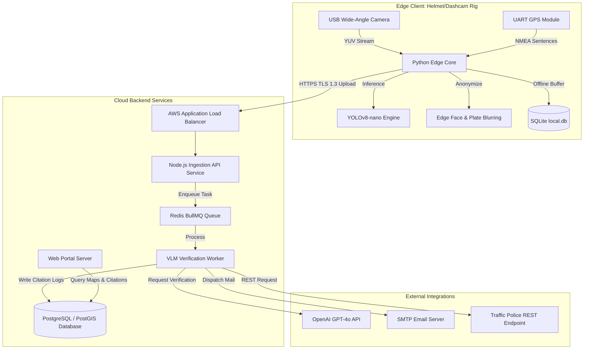
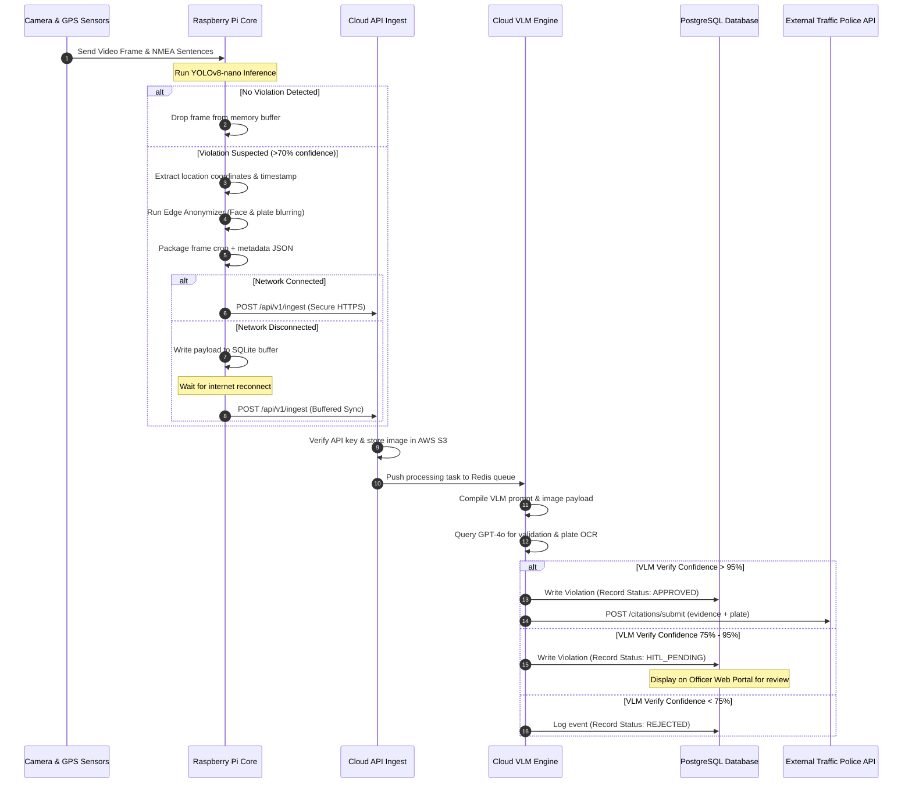

# Document 06: System Architecture Document

---

## 1. High-Level Architecture

The Hawk-AI system utilizes a hybrid Edge-Cloud architecture to distribute processing loads, minimize network bandwidth consumption, and protect citizen privacy.

---

## 2. Component Diagram

The internal microservices are designed for loose coupling:
1. **Edge Telemetry Gatherer**: Reads serial inputs from GPS and camera frames, lining up timestamps.
2. **Edge Vision Filter**: Decides if a frame is clean or a candidate violation.
3. **Anonymizer Engine**: Operates pixel-level gaussian blurs on non-violating elements using OpenCV contours.
4. **Cloud API Gateway**: Validates device credentials, receives data payloads, writes raw files to AWS S3.
5. **VLM Orchestrator**: Handles GPT-4o input/output mapping, runs retry logic for API failures, and parses JSON output blocks.
6. **Dispatch Coordinator**: Generates PDF reports and coordinates API posts to external systems.

---

## 3. Data Flow Diagram

The lifecycle of a single detection event flows through five processing stages:

---

## 4. Deployment Architecture

Deployments are fully containerized using Docker and automated via Infrastructure as Code (IaC) principles:
* **Edge Node**: The software is packed as a Docker image and deployed to the Raspberry Pi OS environment using **BalenaOS** or **Mender.io**, allowing remote updates to the YOLO model and coordinate lists.
* **Cloud Infrastructure**:
  * **API Gateway**: Implemented using Express.js running on AWS ECS (Elastic Container Service) with Auto Scaling.
  * **Database Layer**: AWS RDS PostgreSQL 15 Instance equipped with the PostGIS extension for geo-spatial spatial queries.
  * **Queue Infrastructure**: AWS ElastiCache for Redis, running BullMQ to handle job distribution and prevent system choking under sudden ingestion surges.
  * **Storage**: Amazon S3 for storing evidence images with lifecycle policies that transition files to Glacier Deep Archive after 90 days.

---

## 5. Scalability Considerations

To handle thousands of active commuter streams reporting concurrently during peak rush hours (8:00 AM - 10:00 AM and 5:00 PM - 8:00 PM), several architectural scales are applied:
1. **Asynchronous Processing**: The Cloud API gateway only writes the image to S3 and registers the event metadata in the queue before returning a `202 Accepted` response. This separates edge ingestion from heavy cloud reasoning.
2. **VLM Rate Limit Management**: OpenAI API rate limits (TPM: Tokens Per Minute, RPM: Requests Per Minute) are managed using Redis token buckets. The VLM workers fetch items from the queue only when API capacity is available.
3. **Database Sharding & Partitioning**: The `violations` database table is partitioned monthly based on violation timestamp. Spatial indexing (`GIST` index on geographical coordinates) speeds up map-based queries.

---

## 6. Security Architecture

1. **Edge Device Authentication**: Each Raspberry Pi contains a hardware-encrypted device ID stored in an onboard EEPROM, combined with a unique JWT token refreshed monthly.
2. **VLM Prompt Hardening**: Input prompts are hardcoded templates containing system parameters. The VLM is instructed to ignore any user-supplied text or visual injections (e.g., license plates containing text like "IGNORE VIOLATION").
3. **Data Transit Encryption**: All network traffic uses TLS 1.3. API requests without a valid HTTPS handshaking header are rejected at the Application Load Balancer.
