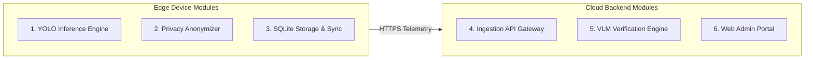

# Document 07: High-Level Design (HLD)

---

## 1. System Modules and Services

The Hawk-AI ecosystem is structured into five core high-level modules:

### 1.1 YOLO Inference Engine (Edge Module)
* **Responsibility**: Processes live frames from the camera, runs the object detection model, filters out clean scenes, and extracts bounding boxes.
* **Services**:
  * `FrameIngestionService`: Pulls frames from the device camera buffer.
  * `DetectionService`: Handles the YOLOv8-nano model execution, computing class labels and coordinates.
  * `FrameBufferManager`: Maintains a rolling queue of the last 15 frames to provide pre-violation context when triggered.

### 1.2 Privacy Anonymizer (Edge Module)
* **Responsibility**: Guarantees that citizen privacy is preserved before data leaves the physical device.
* **Services**:
  * `BlurringService`: Uses OpenCV contours to paint Gaussian blurs over non-violating vehicle license plates and bystander faces.
  * `CropService`: Cuts out only the specific motorcycle and rider bounding box containing the suspected violation.

### 1.3 SQLite Storage & Sync (Edge Module)
* **Responsibility**: Handles local data buffering and manages uploads based on network conditions.
* **Services**:
  * `LocalDBService`: Handles local SQL CRUD operations for offline records.
  * `NetworkMonitorService`: Listens for changes in cellular interface status (e.g., checks connection to DNS).
  * `UploadCoordinator`: Coordinates batched HTTP POST requests to upload buffered events.

### 1.4 Ingestion API Gateway (Cloud Module)
* **Responsibility**: Entry point for all edge devices.
* **Services**:
  * `AuthService`: Verifies device API keys and signs JWT session tokens.
  * `PayloadValidator`: Verifies JSON structures and coordinate values.
  * `S3StorageService`: Manages secure multi-part image uploads to Amazon S3.

### 1.5 VLM Verification Engine (Cloud Module)
* **Responsibility**: Secondary intelligence check to ensure zero false positives reach the police.
* **Services**:
  * `QueueService`: Manages task queues (Redis/BullMQ) to prevent API overloading.
  * `VLMQueryManager`: Interfaces with OpenAI GPT-4o Vision API, managing prompt compiling and error handlers.
  * `CitationGenerator`: Assembles verified information into structured PDFs.
  * `NotificationService`: Sends emails to traffic authorities via SMTP.

---

## 2. Component Interactions

The following interaction map shows how the modules communicate during a live violation lifecycle:

| Source Module | Target Module | Protocol | Data Exchanged | Description |
| :--- | :--- | :--- | :--- | :--- |
| **YOLO Inference Engine** | **Privacy Anonymizer** | In-Memory (IPC) | Numpy Frame Matrix, Bounding Box JSON | Sends suspected violation frame for blurring and cropping. |
| **Privacy Anonymizer** | **SQLite Storage & Sync** | In-Memory (IPC) | Cropped Image (PNG), Metadata Dictionary | Stores blurred crop and geolocation data locally. |
| **SQLite Storage & Sync** | **Ingestion API Gateway** | HTTPS (TLS 1.3) | Multipart Form Data (Metadata JSON + Image File) | Sends the violation payload to the cloud. |
| **Ingestion API Gateway** | **VLM Verification Engine** | BullMQ (Redis) | Job JSON containing S3 Image URI and metadata | Places payload details on queue for background workers. |
| **VLM Verification Engine** | **PostgreSQL DB** | pgpool Connection | SQL Queries | Writes final validation results and updates citation states. |

---

## 3. Architecture Design Decisions

### 3.1 Design Decision: Hybrid Edge-Cloud vs. Pure Cloud Streaming
A critical design question for Hawk-AI was: **Should we stream video directly to the cloud and run YOLO/VLM there, or perform inference on the edge?**

We selected a **Hybrid Edge-Cloud Setup**. Below is the architectural comparison:

| Metric | Pure Cloud Video Streaming | Hybrid Edge-Cloud (Hawk-AI) |
| :--- | :--- | :--- |
| **Bandwidth Consumption** | **Extremely High**: Requires continuous upload of 1080p video (approx. 3-5 GB per hour of riding per user). | **Extremely Low**: Only uploads image crops (~100 KB) of suspected violations. Clean data is dropped locally. |
| **Cellular Network Dependency** | **Critical**: Requires constant, high-speed 4G/5G connection. Fails in tunnels, underpasses, or cellular dead zones. | **Resilient**: Works offline. SQLite buffers up to 2,000 events and syncs when connection returns. |
| **Cloud Compute Cost** | **Prohibitive**: Scaling YOLO inference servers for thousands of parallel 30 FPS video streams is highly expensive. | **Highly Optimized**: Edge processors perform local filtering. The cloud only processes pre-filtered violation candidates. |
| **User Privacy** | **Low**: Continuous streaming records the entire commute, tracking location and capturing raw citizen video. | **High**: Only images of verified violations are uploaded. Non-violating vehicles and pedestrians are blurred on the edge. |
| **System Latency** | Network latency can delay the frame processing, causing missed captures. | Local inference runs on the edge, ensuring instant capture. |

*Conclusion*: A pure cloud video streaming model is impractical for crowdsourced, mobile motorcycle commuters due to high cellular data costs, frequent cellular dead zones, and massive cloud compute hosting expenses. The hybrid edge-cloud architecture is the only design that makes Hawk-AI viable, cost-effective, and respectful of public privacy.
