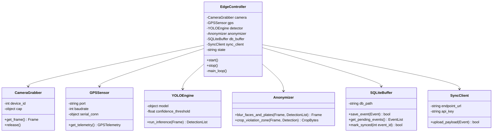
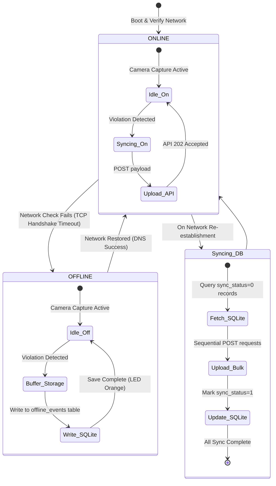

# Document 08: Low-Level Design (LLD)

---

## 1. Core Classes and Interface Specifications (Edge Client)

The edge client core is written in Python. It consists of modular classes managing hardware readouts, model inference, database management, and network synchronization.



---

## 2. Core Function Definitions

### 2.1 Edge YOLO Inference (`YOLOEngine.run_inference`)
```python
def run_inference(self, frame):
    """
    Executes YOLOv8-nano model on a raw OpenCV image frame.
    Input: frame (numpy.ndarray) - Captured video frame.
    Output: detections (list of dict) - List of bounded detections containing:
            [{"class": "no_helmet", "bbox": [x1, y1, x2, y2], "confidence": 0.88}]
    """
    results = self.model(frame, verbose=False)[0]
    detections = []
    for box in results.boxes:
        cls_id = int(box.cls[0])
        label = results.names[cls_id]
        conf = float(box.conf[0])
        
        if label in ["no_helmet", "wrong_way", "divider_jump"] and conf >= self.confidence_threshold:
            bbox = [int(x) for x in box.xyxy[0]]
            detections.append({
                "class": label,
                "bbox": bbox,
                "confidence": conf
            })
    return detections
```

### 2.2 Edge Anonymization (`Anonymizer.blur_faces_and_plates`)
```python
def blur_faces_and_plates(self, frame, detections):
    """
    Applies Gaussian blur to any faces and license plates detected in the frame, 
    EXCEPT for the license plate of the vehicle flagged for a violation.
    Input: frame (numpy.ndarray), detections (list)
    Output: blurred_frame (numpy.ndarray)
    """
    # 1. Identify violating vehicle bounding box
    violating_bboxes = [d["bbox"] for d in detections if d["class"] in ["no_helmet", "wrong_way"]]
    
    # 2. Run standard face and plate detection (local Haar Cascade or secondary lightweight model)
    all_plates = self.plate_cascade.detectMultiScale(frame, 1.1, 4)
    all_faces = self.face_cascade.detectMultiScale(frame, 1.1, 4)
    
    # 3. Apply blur to non-violating objects
    for (x, y, w, h) in all_plates:
        # Check if plate falls inside a violating bounding box. If yes, skip blurring to preserve evidence.
        if not any(bx1 <= x <= bx2 and by1 <= y <= by2 for (bx1, by1, bx2, by2) in violating_bboxes):
            sub_face = frame[y:y+h, x:x+w]
            sub_face = cv2.GaussianBlur(sub_face, (23, 23), 30)
            frame[y:y+h, x:x+w] = sub_face

    for (x, y, w, h) in all_faces:
        # Always blur faces to protect individual privacy
        sub_face = frame[y:y+h, x:x+w]
        sub_face = cv2.GaussianBlur(sub_face, (23, 23), 30)
        frame[y:y+h, x:x+w] = sub_face
        
    return frame
```

---

## 3. Data Structures

### 3.1 Local SQLite Event Schema (`SQLiteBuffer`)
The local SQLite instance (`/opt/hawk-ai/local.db`) utilizes a simplified schema for offline storage:

```sql
CREATE TABLE IF NOT EXISTS offline_events (
    id INTEGER PRIMARY KEY AUTOINCREMENT,
    device_uuid TEXT NOT NULL,
    timestamp TEXT NOT NULL,
    latitude REAL NOT NULL,
    longitude REAL NOT NULL,
    speed REAL,
    violation_type TEXT NOT NULL,
    confidence REAL NOT NULL,
    image_blob BLOB NOT NULL,
    sync_status INTEGER DEFAULT 0  -- 0 = pending, 1 = synced, 2 = failed_retry
);
```

---

## 4. Offline Connectivity State Machine

The Edge Client Controller runs a background thread that continuously checks network connectivity. If the cell signal drops (e.g., when riding through tunnels, remote areas, or cellular dead zones), the system transitions between states:


