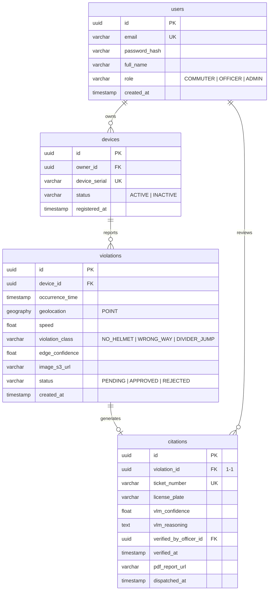

# Document 09: Database Design Document

---

## 1. Entity-Relationship Diagram (ERD)

The PostgreSQL database manages relational links between registered devices, contributors, detected violations, and generated citations.



---

## 2. Table Schemas and Constraints

### 2.1 Table: `users`
Stores user profile records for both commuters (who register devices) and traffic police officers (who review citations).
```sql
CREATE TABLE users (
    id UUID PRIMARY KEY DEFAULT gen_random_uuid(),
    email VARCHAR(255) UNIQUE NOT NULL,
    password_hash VARCHAR(255) NOT NULL,
    full_name VARCHAR(100) NOT NULL,
    role VARCHAR(20) NOT NULL CHECK (role IN ('COMMUTER', 'OFFICER', 'ADMIN')),
    created_at TIMESTAMP WITH TIME ZONE DEFAULT CURRENT_TIMESTAMP NOT NULL
);
```

### 2.2 Table: `devices`
Tracks registered Raspberry Pi edge nodes.
```sql
CREATE TABLE devices (
    id UUID PRIMARY KEY DEFAULT gen_random_uuid(),
    owner_id UUID NOT NULL REFERENCES users(id) ON DELETE CASCADE,
    device_serial VARCHAR(100) UNIQUE NOT NULL,
    status VARCHAR(20) DEFAULT 'ACTIVE' CHECK (status IN ('ACTIVE', 'INACTIVE')),
    registered_at TIMESTAMP WITH TIME ZONE DEFAULT CURRENT_TIMESTAMP NOT NULL
);
```

### 2.3 Table: `violations`
Stores incoming violation payloads from edge nodes.
```sql
CREATE TABLE violations (
    id UUID PRIMARY KEY DEFAULT gen_random_uuid(),
    device_id UUID NOT NULL REFERENCES devices(id) ON DELETE CASCADE,
    occurrence_time TIMESTAMP WITH TIME ZONE NOT NULL,
    geolocation GEOGRAPHY(POINT, 4326) NOT NULL, -- Latitude and Longitude using WGS 84
    speed NUMERIC(5,2), -- Speed in km/h
    violation_class VARCHAR(30) NOT NULL CHECK (violation_class IN ('NO_HELMET', 'WRONG_WAY', 'DIVIDER_JUMP')),
    edge_confidence NUMERIC(4,3) NOT NULL,
    image_s3_url VARCHAR(512) NOT NULL,
    status VARCHAR(20) DEFAULT 'PENDING' CHECK (status IN ('PENDING', 'APPROVED', 'REJECTED')),
    created_at TIMESTAMP WITH TIME ZONE DEFAULT CURRENT_TIMESTAMP NOT NULL
);
```

### 2.4 Table: `citations`
Stores VLM verification records, extracted plate OCR data, and dispatch audit logs.
```sql
CREATE TABLE citations (
    id UUID PRIMARY KEY DEFAULT gen_random_uuid(),
    violation_id UUID UNIQUE NOT NULL REFERENCES violations(id) ON DELETE CASCADE,
    ticket_number VARCHAR(100) UNIQUE NOT NULL,
    license_plate VARCHAR(20) NOT NULL,
    vlm_confidence NUMERIC(4,3) NOT NULL,
    vlm_reasoning TEXT,
    verified_by_officer_id UUID REFERENCES users(id) ON DELETE SET NULL,
    verified_at TIMESTAMP WITH TIME ZONE,
    pdf_report_url VARCHAR(512),
    dispatched_at TIMESTAMP WITH TIME ZONE
);
```

---

## 3. Database Indexing Strategy

To maintain sub-second query performance as the database scales to millions of violations, spatial and field indexes are applied:

1. **Spatial Index**: Necessary for GIS queries (e.g., fetching all violations within a 1km radius of a junction for hotspot analysis).
   ```sql
   CREATE INDEX idx_violations_geom ON violations USING GIST(geolocation);
   ```
2. **Date Partition Index**: Since violations are queried by chronological order on the dashboards, a compound index on class and time is applied.
   ```sql
   CREATE INDEX idx_violations_time_class ON violations(occurrence_time DESC, violation_class);
   ```
3. **Lookup Index**: Index on license plate text to quickly retrieve history records of repeating offenders.
   ```sql
   CREATE INDEX idx_citations_plate ON citations(license_plate);
   ```
4. **Foreign Key Indexes**: Prevents sequential database scans on relational joins.
   ```sql
   CREATE INDEX idx_violations_device ON violations(device_id);
   CREATE INDEX idx_citations_violation ON citations(violation_id);
   ```

---

## 4. Sample SQL Data (Seed Script)

```sql
-- Seed Users
INSERT INTO users (id, email, password_hash, full_name, role) VALUES 
('a6d36e2b-2615-4654-a6c3-8822db520612', 'amit.k@gmail.com', '$2b$12$K1yO6Zl7e/gT6qHj5uP1eO8a', 'Amit Kumar', 'COMMUTER'),
('b5e28a1c-3726-4765-b7d4-9933ec631723', 's.patil@police.gov.in', '$2b$12$R2yP7Am8f/hU7rIk6vQ2fO9b', 'Officer Patil', 'OFFICER');

-- Seed Device
INSERT INTO devices (id, owner_id, device_serial, status) VALUES
('c7f49a2d-4837-4876-c8e5-0044fd742834', 'a6d36e2b-2615-4654-a6c3-8822db520612', 'WD-RP5-0004512A', 'ACTIVE');

-- Seed Violation (Bengaluru Richmond Circle Coordinates)
INSERT INTO violations (id, device_id, occurrence_time, geolocation, speed, violation_class, edge_confidence, image_s3_url, status) VALUES
('d8a50b3e-5948-4987-d9f6-1155ae853945', 'c7f49a2d-4837-4876-c8e5-0044fd742834', '2026-05-31 08:30:15+05:30', ST_SetSRID(ST_MakePoint(77.5946, 12.9716), 4326), 24.50, 'NO_HELMET', 0.892, 'https://s3.hawk-ai.ai/evidence/20260531_d8a50b3e.jpg', 'APPROVED');

-- Seed Citation
INSERT INTO citations (id, violation_id, ticket_number, license_plate, vlm_confidence, vlm_reasoning, verified_by_officer_id, verified_at, pdf_report_url, dispatched_at) VALUES
('e9b61c4f-6059-5098-e0a7-2266bf964056', 'd8a50b3e-5948-4987-d9f6-1155ae853945', 'CIT-2026-009841', 'KA03HA5512', 0.985, 'Confirmed rider is not wearing a helmet. Extracted license plate: KA03HA5512.', 'b5e28a1c-3726-4765-b7d4-9933ec631723', '2026-05-31 08:32:00+05:30', 'https://s3.hawk-ai.ai/reports/CIT-2026-009841.pdf', '2026-05-31 08:32:05+05:30');
```
