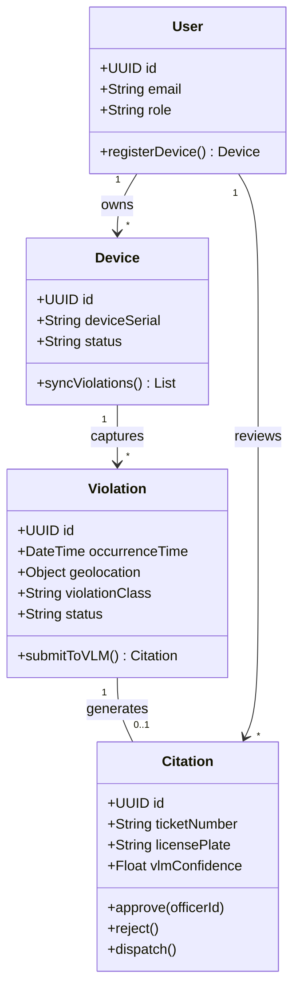
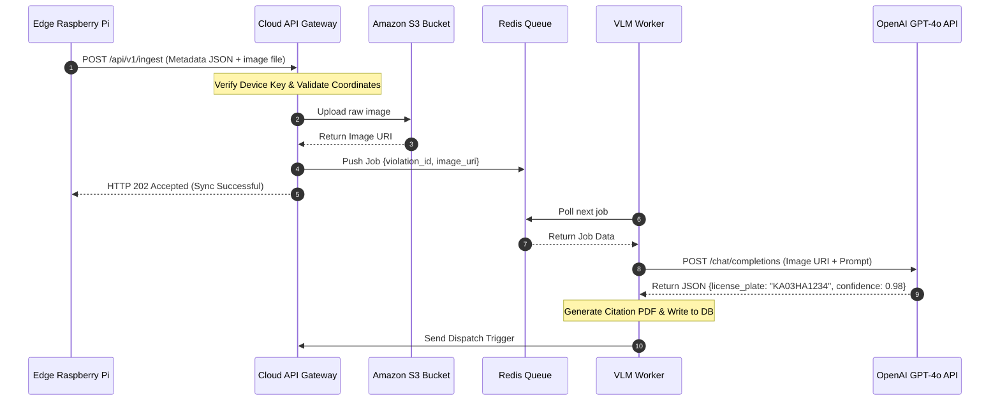
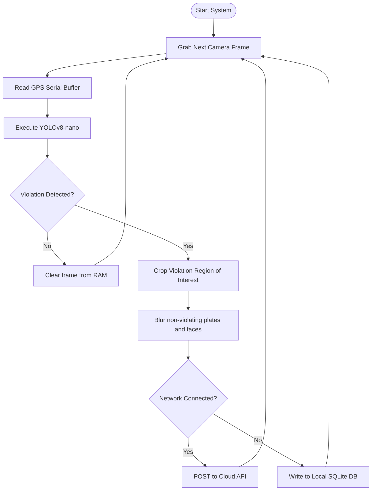
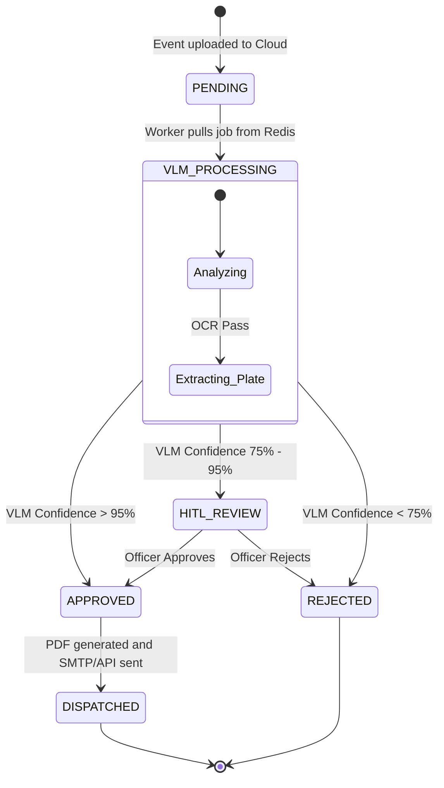

# Document 10: UML Documentation

---

## 1. Use Case Diagram

The use case diagram defines interactions between actors (Commuters, Officers, Administrators, and VLM API) and the system.

```mermaid
leftToRightDirection
actor Commuter as "Commuter (Data Contributor)"
actor Officer as "Traffic Officer"
actor Admin as "System Administrator"
actor VLM as "OpenAI VLM API"

rectangle Hawk-AI_AI_System {
    usecase UC1 as "Register Edge Device"
    usecase UC2 as "Passive Capture & Sync"
    usecase UC3 as "Review Pending Queue"
    usecase UC4 as "Approve/Reject Citations"
    usecase UC5 as "Analyze Violation Hotspots"
    usecase UC6 as "Manage User Accounts"
    usecase UC7 as "Verify Violation & Extract Plate"
}

Commuter --> UC1
Commuter --> UC2
Officer --> UC3
Officer --> UC4
Officer --> UC5
Admin --> UC6
Admin --> UC5
VLM --> UC7
UC2 ..> UC7 : "<<includes>>"
UC7 ..> UC4 : "<<precedes>>"
```

---

## 2. Class Diagram

The core classes in the Cloud API Backend structure the business logic.



---

## 3. Sequence Diagram: Edge-Cloud Event Sync

Details the sequence of network handshakes when uploading and verifying a suspected violation.



---

## 4. Activity Diagram: Edge Detection Cycle

Shows the active control flow inside the Raspberry Pi edge client.



---

## 5. State Diagram: Violation Event Lifecycle

Tracks the database states of a single violation report.



---

## 6. Component Diagram

Shows the container boundaries of the deployed modules.

```mermaid
component {
    [React Admin Client] as UI
    [Express Gateway] as Gateway
    [VLM Processor] as Worker
    [Postgres DB] as DB
    [Redis Store] as Cache
    [Mender Client] as Mender

    UI --> Gateway : "HTTPS API Calls"
    Gateway --> Cache : "BullMQ Jobs"
    Worker --> Cache : "Poll Jobs"
    Worker --> DB : "Write SQL"
    Gateway --> DB : "Read SQL"
    Mender --> Gateway : "Check Updates"
}
```
