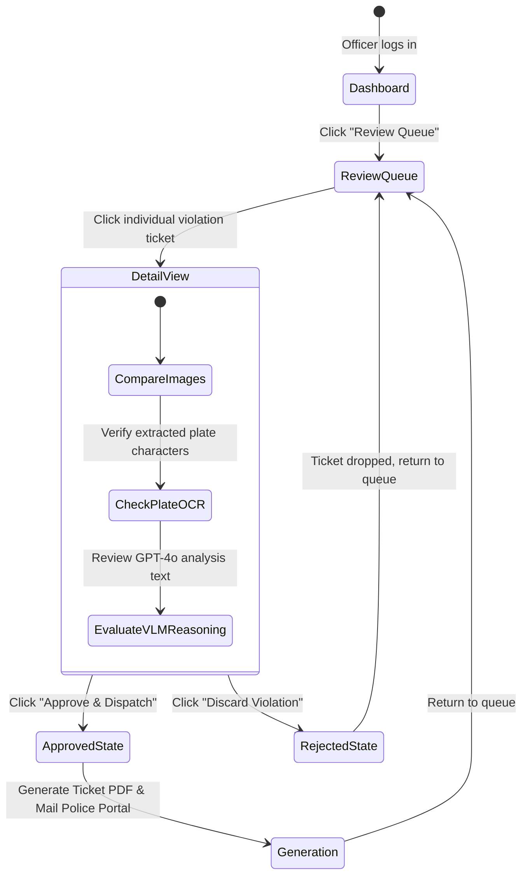

# Document 12: UI/UX Documentation

---

## 1. Information Architecture (IA)

The Web Portal dashboard is organized hierarchically to serve municipal review tasks:

```text
[Home: Login Page]
    └── [Main Dashboard]
         ├── [Review Queue] 
         │    └── [Citation detail pane (comparison images, VLM analysis, Action buttons)]
         ├── [Citation Records Database]
         │    └── [Search and filter tables by plate, date, or class]
         ├── [Spatial Analytics Map]
         │    └── [Junction hot-spot overlays, traffic count charts]
         └── [Device Management Portal]
              └── [List active Raspberry Pi nodes, generate API keys]
```

---

## 2. Interactive User Flows

### 2.1 Officer Review User Flow


---

## 3. Wireframe Layout Descriptions

### 3.1 The Web Admin Portal Dashboard Layout
*   **Top Navigation Bar**: Fixed bar featuring the Hawk-AI logo (neon orange/dark theme), navigation links (`Review Queue`, `Spatial Map`, `Devices`, `System Audit Log`), notifications icon, and user profile metadata (Officer ID).
*   **Left Column (35% width)**: A scrollable, list-card interface displaying pending violations. Each card shows:
    *   Thumbnail of blurred evidence image.
    *   Relative timestamp (e.g., *"12 minutes ago"*).
    *   Violation badge tag (e.g., orange tag for `Wrong Way`, yellow tag for `No Helmet`).
    *   Initial confidence scores (VLM: 82%).
*   **Right Column / Main Display (65% width)**: Detail View of the selected violation.
    *   **Header Panel**: Shows the location coordinate link, timestamp, device serial, and speed.
    *   **Side-by-Side Image Container**:
        *   *Left Box*: The cropped evidence photo with bounded highlight boxes around the violation region.
        *   *Right Box*: Extracted close-up crop of the license plate (highlighted and processed for OCR contrast enhancement).
    *   **Data Fields Editor**: A form with editable text box containing the VLM extracted plate text (e.g., `KA-03-HA-5512`). The officer can overwrite this text if OCR contains errors.
    *   **Model Audit Text Area**: Display box containing the GPT-4o chain-of-thought explanation: *"Rider is wearing a blue baseball cap which YOLOv8 flagged as bareheaded. Confirming no safety helmet is present."*
    *   **Actions Row**: Contains two large buttons:
        *   *Reject Violation* (Secondary gray button, shifts focus to previous panel on press).
        *   *Approve & Issue Citation* (Primary active neon green button, triggers background PDF render and moves to next card).

---

## 4. Accessibility Requirements (WCAG 2.1)

Hawk-AI dashboards adhere to the Web Content Accessibility Guidelines (WCAG) 2.1 Level AA standard:
1. **Color Contrast**: Text and interactive components must maintain a contrast ratio of at least **4.5:1** against backgrounds. Focus outlines on inputs must have a **3:1** contrast.
2. **Keyboard Navigation**: All interactions (tabs, detail selectors, approvals) must be executable via keyboard commands:
   * `Tab` key shifts focus through the list.
   * `Space` / `Enter` activates button focus.
   * `A` key acts as a hotkey to approve.
   * `D` key acts as a hotkey to discard.
3. **Screen Readers**: All image elements must include dynamic descriptions:
   * ``

---

## 5. Visual Design System

### 5.1 Style Guide & Color Palette
The interface uses a modern dark theme inspired by cyber-enforcement aesthetics, leveraging sleek HSL-tailored colors and smooth glassmorphism containers:

```css
:root {
  /* Color Palette */
  --bg-primary: hsl(220, 25%, 8%);        /* Deep slate background */
  --bg-surface: rgba(26, 32, 44, 0.7);    /* Glassmorphic card surface */
  --border-glass: rgba(255, 255, 255, 0.08);
  
  --text-primary: hsl(0, 0%, 96%);        /* High-contrast white */
  --text-muted: hsl(220, 10%, 65%);       /* Muted gray text */

  /* Status Colors */
  --accent-neon-green: hsl(140, 85%, 45%); /* Success/Approved button */
  --accent-neon-red: hsl(355, 85%, 55%);   /* Danger/Rejected button */
  --accent-warning: hsl(38, 95%, 50%);     /* Pending review indicators */
  
  /* Typography */
  --font-family: 'Outfit', 'Inter', system-ui, sans-serif;
}
```

### 5.2 UI Component Elements
*   **Glassmorphism Container Style**: Cards and panels must feature a subtle blur backdrop to create depth:
    ```css
    .card-glass {
      background: var(--bg-surface);
      backdrop-filter: blur(12px);
      border: 1px solid var(--border-glass);
      border-radius: 12px;
      box-shadow: 0 8px 32px 0 rgba(0, 0, 0, 0.37);
    }
    ```
*   **Interactive Transitions**: Interactive elements must animate smoothly:
    ```css
    .btn-action {
      transition: all 0.25s cubic-bezier(0.4, 0, 0.2, 1);
    }
    .btn-action:hover {
      transform: translateY(-2px);
      box-shadow: 0 4px 20px var(--accent-neon-green-glow);
    }
    ```
