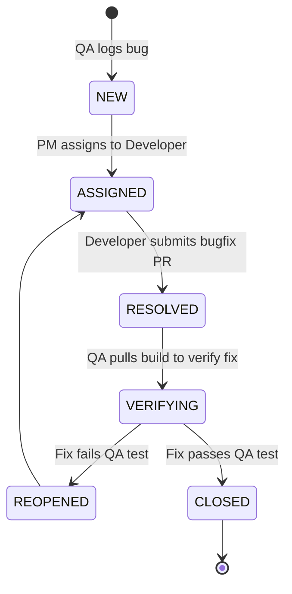

# Document 16: Defect & Bug Tracking Report

---

## 1. Defect Severity and Priority Definitions

To manage defects during development, the Hawk-AI QA team uses the following definitions:

### 1.1 Severity Scale (Impact on System Stability)
* **S1: Critical**: Total system crash, hardware locks, or critical privacy leaks (e.g., uploading unblurred pedestrian faces to the cloud).
* **S2: Major**: Key function fails with no workaround (e.g., SQLite sync fails during network restore, or GPS coordinates fail to associate with crops).
* **S3: Minor**: System remains functional but minor functions fail (e.g., LED color indicator displays green instead of blue during offline mode).
* **S4: Cosmetic**: UI styling alignment errors, typography font issues.

### 1.2 Priority Scale (Urgency to Resolve)
* **P1: Immediate**: Blocks testing or core product releases. Needs resolution within 24 hours.
* **P2: High**: Impacts core user flows. Must be resolved before the current sprint ends.
* **P3: Medium**: Small feature bugs. Can be planned for a future sprint backlog.
* **P4: Low**: Visual tweaks. Resolved when resources permit.

---

## 2. Bug Lifecycle States

---

## 3. Mock Defects Log

### 3.1 Defect 001: Critical Privacy Leak - Unblurred Faces Uploaded
* **Defect ID**: `BUG-WD-001`
* **Severity**: `S1 (Critical)` | **Priority**: `P1 (Immediate)`
* **Status**: `RESOLVED`
* **Found In Build**: `v0.8.2-edge`
* **Environment**: Raspberry Pi 4, Wide-Angle Camera
* **Reporter**: QA Analyst Rajesh M.
* **Description**: Under rapid head panning (high vibration), the facial Haar cascade classifier fails to detect and blur bystander faces within 350ms of a violation capture, causing unblurred bystander images to be serialized and uploaded to the Cloud Ingestion API.
* **Steps to Reproduce**:
  1. Boot the Pi edge device with high-vibration engine mounts active.
  2. Perform a sharp, fast head rotation while a wrong-way motorcycle crosses.
  3. Verify the uploaded image crop on the backend. Bystander faces are fully recognizable.
* **Resolution Description**: Increased the sliding camera buffer from 5 to 15 frames to allow multi-pass smoothing, ensuring bounding box coordinates align with face positions. Added a fallback filter that applies a default Gaussian blur on all non-motorcycle coordinates if face detection fails.

---

### 3.2 Defect 002: Major System Bug - SQLite Buffer Lock under Concurrent Writes
* **Defect ID**: `BUG-WD-002`
* **Severity**: `S2 (Major)` | **Priority**: `P2 (High)`
* **Status**: `CLOSED`
* **Found In Build**: `v0.9.1-edge`
* **Reporter**: Developer Elena Vance
* **Description**: When riding through deep cellular dead zones, if multiple violations are detected in rapid succession (under 2 seconds apart), the local Python script throws `sqlite3.OperationalError: database is locked` because the database writer process blocks concurrent write threads.
* **Resolution Description**: Modified `SQLiteBuffer` class implementation. Instantiated the SQLite connection with `check_same_thread=False` and implemented a thread-safe synchronized queue to write events sequentially.

---

### 3.3 Defect 003: Minor UI Bug - Spatial Map coordinates shift in Safari Mobile
* **Defect ID**: `BUG-WD-003`
* **Severity**: `S4 (Cosmetic)` | **Priority**: `P4 (Low)`
* **Status**: `NEW`
* **Reporter**: Product Manager Amit K.
* **Description**: The leaflet map marker overlays in the Admin Portal shift 15px north when viewed on mobile Safari browser (iOS 16) due to dynamic viewport resizing styling quirks.
