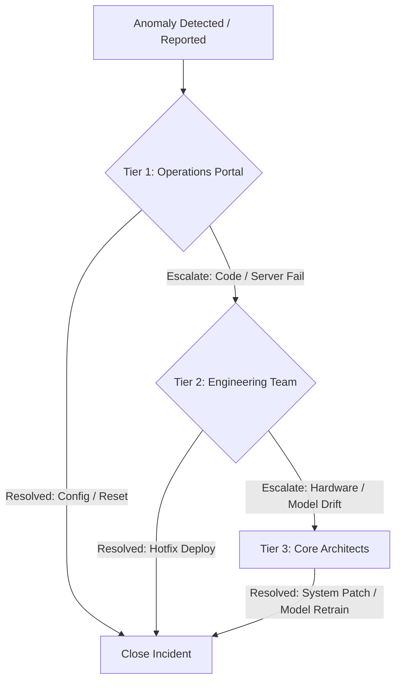

# Document 18: Maintenance & Support Documentation

---

## 1. Change Management Procedures

Changes to the Hawk-AI platform (both edge and cloud modules) follow a standard deployment process:

1. **Request for Change (RFC)**: Developers submit changes via GitHub Pull Requests.
2. **Review & Test**: Code undergoes lint checking, unit testing, and is deployed to a staging environment (`staging.hawk-ai.ai`).
3. **Approval**: Technical Lead and QA approve the PR based on successful testing outcomes.
4. **Scheduled Deploy**: Deployment to production takes place during maintenance windows (Tuesday 02:00 - 04:00 UTC) to minimize user disruption.

---

## 2. Incident Management Framework

System anomalies are handled through a tiered support structure:



* **Tier 1 (L1 Support - Operations)**: Monitors system alerts on Grafana. Manages common user problems (e.g., helping commuters register devices, resetting credentials).
* **Tier 2 (L2 Support - DevOps & Backend Developers)**: Handles server errors, API failures, database performance degradation, and deploys system hotfixes.
* **Tier 3 (L3 Support - Core Architects & ML Engineers)**: Investigates model accuracy degradation (model drift), hardware incompatibilities, and database sharding failures.

---

## 3. Over-The-Air (OTA) Model Upgrade Workflows

To update the local YOLO object detection weights on thousands of active edge devices, Hawk-AI uses **Mender.io**:

```text
[ML Lab] Retrain YOLO Model (YOLOv8n -> YOLOv8n-custom-v2)
  │
  ▼
[Compile Update Package] Build Mender Artifact (.mender container update)
  │
  ▼
[Mender Management Cloud] Deploy release task target group
  │
  ▼
[Edge RPi Device]
   ├── 1. Query Update API
   ├── 2. Download Mender Artifact to inactive Partition B
   ├── 3. Reboot into Partition B
   └── 4. Health Check: Run inference loop validation
         ├── Successful: Commit and set Partition B as active
         └── Failed: Revert boot flag to Partition A and notify server
```

### 3.1 Hot-Reloading Model Weights
The edge client core is built to hot-reload the weights file without restarting the main camera ingestion loop:
1. The client process listens for system signals (`SIGUSR2`) or monitors the weights directory (`/opt/hawk-ai/model/`) for changes.
2. Upon download of a new weights file (`best_v2.engine` or `.onnx`), the `YOLOEngine` instantiates a temporary engine object in the background.
3. Once loaded, the reference pointer is updated in memory, and the old engine object is garbage collected, ensuring zero frame loss during updates.

---

## 4. Systems Knowledge Base

### 4.1 KB-101: Relinking DB geographic connections
* **Problem**: PostGIS database queries slow down, causing timeouts on geographic maps.
* **Solution**: Rebuild spatial indexes. Run the database maintenance script:
  ```sql
  REINDEX INDEX idx_violations_geom;
  VACUUM ANALYZE violations;
  ```

### 4.2 KB-102: Resetting local Edge Client storage
* **Problem**: The local SD card is full, and sqlite sync is blocked due to corrupt logs.
* **Solution**: Clean local buffers. SSH into the Pi and execute:
  ```bash
  sudo systemctl stop hawk-ai-client
  rm /opt/hawk-ai/local.db
  sqlite3 /opt/hawk-ai/local.db "VACUUM;"
  sudo systemctl start hawk-ai-client
  ```
