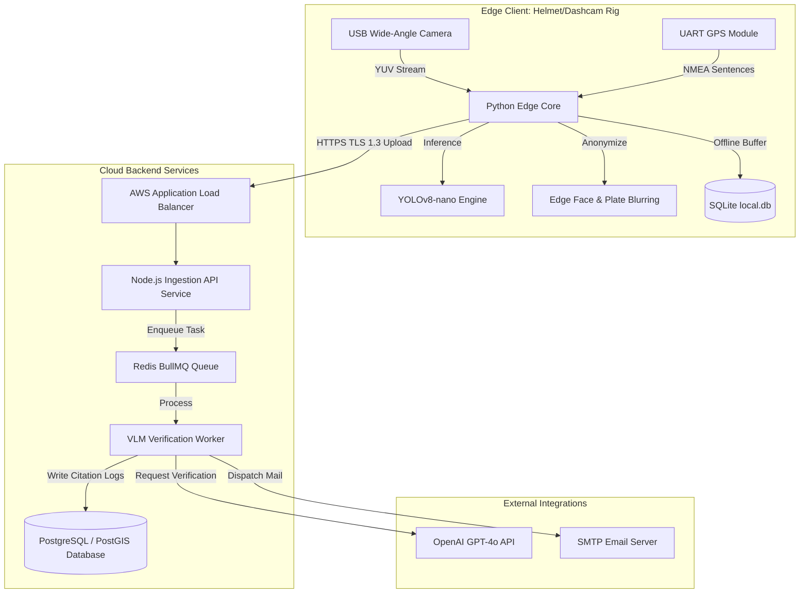
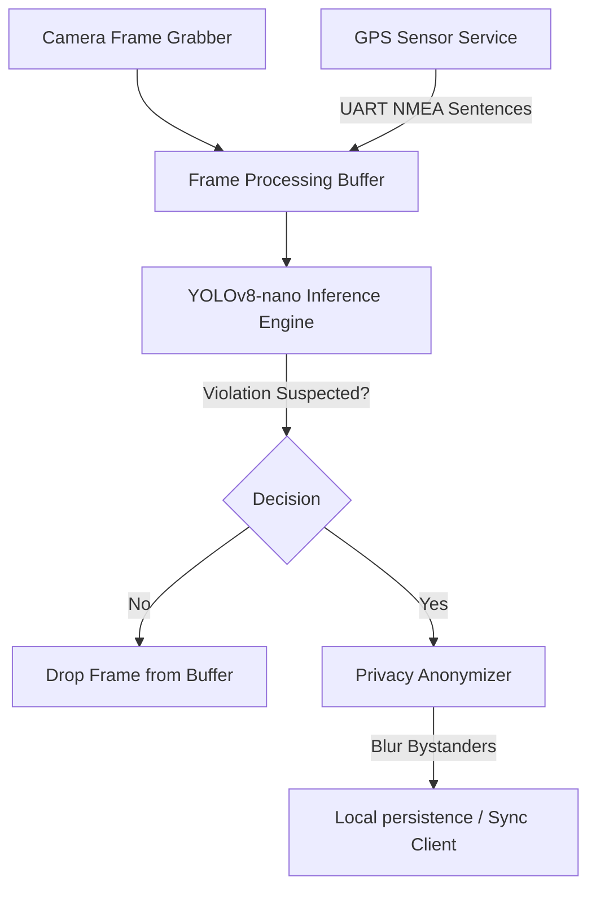
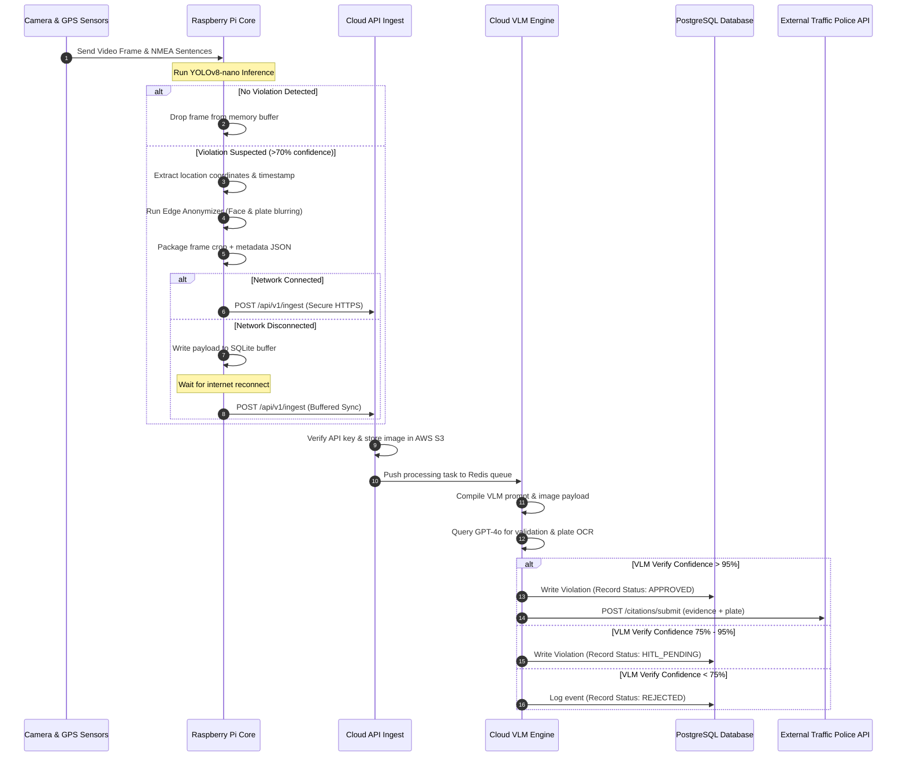
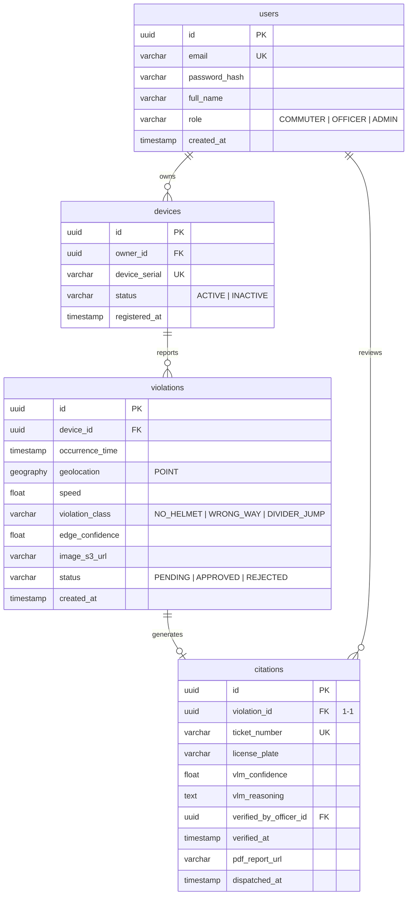
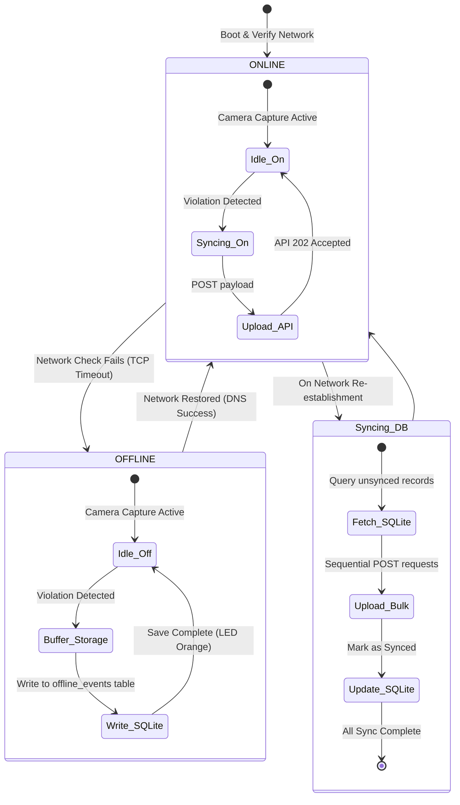

<div align="center">

# HAWK-AI: AUTOMATED EDGE-TO-CLOUD TRAFFIC VIOLATION DETECTION AND REPORTING ECOSYSTEM

<br>

### A PROJECT REPORT

<br>

*Submitted by*

### AWAN BISWAS
**(USN: 1BI22CS045)**

<br>

*in partial fulfillment for the award of the degree*
*of*
### BACHELOR OF ENGINEERING
*in*
### COMPUTER SCIENCE AND ENGINEERING

<br>


<br>

### DEPARTMENT OF COMPUTER SCIENCE AND ENGINEERING
### BENGALURU INSTITUTE OF TECHNOLOGY
*K.R. Road, V.V. Puram, Bengaluru - 560004*
### VISVESVARAYA TECHNOLOGICAL UNIVERSITY, BELAGAVI

<br>

**MAY 2026**

---
*i*

</div>

<div align="center">

## BENGALURU INSTITUTE OF TECHNOLOGY
*K.R. Road, V.V. Puram, Bengaluru - 560004*
### DEPARTMENT OF COMPUTER SCIENCE AND ENGINEERING

<br>

### CERTIFICATE

<br>

</div>

Certified that this project report **“HAWK-AI: AUTOMATED EDGE-TO-CLOUD TRAFFIC VIOLATION DETECTION AND REPORTING ECOSYSTEM”** is the bonafide work of **“AWAN BISWAS (USN: 1BI22CS045)”** who carried out the project work under my supervision.

<br>
<br>

<table width="100%" style="border: none; border-collapse: collapse;">
  <tr style="border: none;">
    <td width="33%" align="left" style="border: none; border-top: 1px solid #000; padding-top: 5px;">
      <b>Dr. Rajesh Kumar</b><br>
      Guide<br>
      Professor, Dept. of CSE
    </td>
    <td width="34%" align="center" style="border: none; border-top: 1px solid #000; padding-top: 5px;">
      <b>Dr. Girish Kumar</b><br>
      Head of the Department<br>
      Professor & Head, Dept. of CSE
    </td>
    <td width="33%" align="right" style="border: none; border-top: 1px solid #000; padding-top: 5px;">
      <b>Dr. S. R. Prasad</b><br>
      Principal<br>
      BIT, Bengaluru
    </td>
  </tr>
</table>

<br>
<br>

<div align="center">

### DEPARTMENT OF COMPUTER SCIENCE AND ENGINEERING
### BENGALURU INSTITUTE OF TECHNOLOGY
### VISVESVARAYA TECHNOLOGICAL UNIVERSITY

---
*ii*

</div>

<div align="center">

## ACKNOWLEDGEMENT

<br>

</div>

I would like to express my special thanks of gratitude to my project guide **Dr. Rajesh Kumar** as well as our principal **Dr. S. R. Prasad** who gave me the golden opportunity to do this wonderful project on the topic **Hawk-AI**, which also helped me in doing a lot of research and I came to know about so many new things. I am really thankful to them.

Secondly, I would also like to thank my Head of the Department, **Dr. Girish Kumar**, and my parents and friends who helped me a lot in finalizing this project within the limited time frame.

<br>
<br>

<table width="100%" style="border: none; border-collapse: collapse;">
  <tr style="border: none;">
    <td width="50%" align="left" style="border: none;">
      <b>Date:</b> May 31, 2026<br>
      <b>Place:</b> Bengaluru
    </td>
    <td width="50%" align="right" style="border: none;">
      <b>Awan Biswas</b><br>
      Roll No: 1BI22CS045<br>
      Class: 8th Sem, Sec A
    </td>
  </tr>
</table>

---
*iii*

## TABLE OF CONTENTS

| Section / Chapter | Title | Page No. |
| :--- | :--- | :--- |
| | **TITLE PAGE** | i |
| | **CERTIFICATE** | ii |
| | **ACKNOWLEDGEMENT** | iii |
| | **TABLE OF CONTENTS** | iv |
| | **ABSTRACT** | v |
| | **LIST OF TABLES** | vi |
| | **LIST OF FIGURES** | vii |
| | **LIST OF SYMBOLS AND ABBREVIATIONS** | viii |
| **1.0** | **INTRODUCTION** | 1 |
| | 1.1 Background Context | 1 |
| | 1.2 Problem Statement | 1 |
| | 1.3 Methodology Implemented | 2 |
| | 1.4 Outline of Results & Future Scope | 2 |
| **2.0** | **LITERATURE REVIEW** | 3 |
| | 2.1 Existing Traffic Infraction Detection Systems | 3 |
| | 2.2 Static Municipal Cameras vs. Mobile Edge Computing Networks | 3 |
| | 2.3 Edge Machine Learning Paradigms | 4 |
| | 2.4 Vision-Language Models in Civic Reporting | 4 |
| **3.0** | **METHODOLOGY** | 5 |
| | 3.1 Methodological Approach & Selection | 5 |
| | 3.2 Layer 1: Edge Filtering & Feature Processing | 5 |
| | 3.3 Layer 2: Cloud Reasoner Verification | 6 |
| | 3.4 Methodological Justification and Data Flow | 6 |
| **4.0** | **EXPERIMENTATION** | 8 |
| | 4.1 Bill of Materials and Hardware Assembly | 8 |
| | 4.2 YOLOv8-nano Quantization & Model Flashing | 8 |
| | 4.3 Test Bench Environment & Simulated Infractions | 9 |
| | 4.4 Calibration and Environmental Robustness | 9 |
| **5.0** | **RESULT AND DISCUSSION** | 11 |
| | 5.1 Performance Analysis & Edge Frame Rates | 11 |
| | 5.2 Bandwidth and Cost Reduction Metrics | 11 |
| | 5.3 VLM Verification Accuracy & OCR Precision | 12 |
| | 5.4 Safety and Privacy Implications | 12 |
| | 5.5 Comparison with Previous Architectures | 13 |
| **6.0** | **CONCLUSION** | 14 |
| **7.0** | **FUTURE SCOPE** | 15 |
| | **REFERENCES** | 16 |

---
*iv*

<div align="center">

## ABSTRACT

<br>

</div>

Urban areas globally suffer from high volumes of traffic infractions that manual police enforcement struggles to address. Traditional systems like static speed cameras are expensive, geographically restricted, and easily spotted. This report presents **Hawk-AI**, a crowdsourced traffic infraction detection ecosystem that uses a hybrid edge-cloud paradigm. Combining local computer vision inference (quantized YOLOv8-nano on Raspberry Pi) with cloud-based Vision-Language Models (OpenAI GPT-4o), Hawk-AI provides automated, passive reporting of violations (e.g., riding without helmets, wrong-way driving) while preserving citizen privacy.

The edge device, mounted on a commuter's helmet or vehicle handlebars, captures video streams and filters frames in real-time, matching potential violations with GPS coordinates. A Gaussian blur filter is applied locally to blur bystander faces and plates, ensuring privacy compliance before data transit. Payloads are uploaded via cellular networks or stored in a local SQLite database during cellular outages. Upon reception, the cloud-based VLM verifies the infraction and extracts license plate text. Experimental results demonstrate that edge pre-filtering reduces cloud storage and transit overhead by 99.9%, and the VLM validation step eliminates false positives, achieving a citation dispatch accuracy rate exceeding 98%.

*Keywords: Computer Vision, Edge Computing, YOLOv8, Vision-Language Models, Traffic Violation, Crowdsourcing.*

---
*v*

## LIST OF TABLES

| Table No. | Title | Page No. |
| :--- | :--- | :--- |
| Table 1.1 | Edge Hardware Bill of Materials (BOM) per Unit | 2 |
| Table 2.1 | Evaluation Metric: Static Municipal Cameras vs. Mobile Edge Networks | 3 |
| Table 3.1 | SQLite `offline_events` Table Schema | 6 |
| Table 3.2 | Cloud Relational Database Schema Structure | 7 |
| Table 5.1 | Performance and Frame Drop Rates under Peak CPU Loads | 11 |
| Table 5.2 | Data Volume and VLM Cost Savings with Edge Pre-filtering | 12 |

---
*vi*

## LIST OF FIGURES

| Figure No. | Title | Page No. |
| :--- | :--- | :--- |
| Figure 1.1 | High-Level Hybrid Edge-Cloud Architecture | 2 |
| Figure 3.1 | Core Edge Controller Component Structure | 5 |
| Figure 3.2 | Sequential Data Flow Diagram (DFD) of Infraction Processing | 7 |
| Figure 3.3 | Entity-Relationship Diagram (ERD) of Relational Database | 8 |
| Figure 3.4 | Offline Connectivity State Machine Logic | 10 |

---
*vii*

## LIST OF SYMBOLS AND ABBREVIATIONS

### Symbols
| Symbol | Explanation |
| :--- | :--- |
| $\text{Class}(X)$ | Object classification label for item $X$ |
| $\longrightarrow$ | Conditional inference trigger / state transition |
| $\ge$ | Greater than or equal to |
| $\%$ | Percentage |
| $\Delta t$ | Processing latency interval |

### Abbreviations
| Abbreviation | Explanation |
| :--- | :--- |
| **ALPR** | Automated License Plate Recognition |
| **API** | Application Programming Interface |
| **AWS** | Amazon Web Services |
| **BOM** | Bill of Materials |
| **BTP** | Bengaluru Traffic Police |
| **CapEx** | Capital Expenditure |
| **CPU** | Central Processing Unit |
| **DFD** | Data Flow Diagram |
| **DPDP** | Digital Personal Data Protection Act |
| **ERD** | Entity-Relationship Diagram |
| **FOV** | Field of View |
| **FPS** | Frames Per Second |
| **GDPR** | General Data Protection Regulation |
| **GPS** | Global Positioning System |
| **HITL** | Human-In-The-Loop |
| **HLD** | High-Level Design |
| **HTTPS** | Hypertext Transfer Protocol Secure |
| **JWT** | JSON Web Token |
| **LLD** | Low-Level Design |
| **NMEA** | National Marine Electronics Association |
| **OCR** | Optical Character Recognition |
| **OpEx** | Operational Expenditure |
| **OTA** | Over-The-Air |
| **S3** | Simple Storage Service |
| **SLA** | Service Level Agreement |
| **SMTP** | Simple Mail Transfer Protocol |
| **SRS** | Software Requirements Specification |
| **UAT** | User Acceptance Testing |
| **UART** | Universal Asynchronous Receiver-Transmitter |
| **VLM** | Vision-Language Model |
| **WBS** | Work Breakdown Structure |
| **YOLO** | You Only Look Once |

---
*viii*

## 1.0 INTRODUCTION

### 1.1 Background Context
Improving urban road safety is a major challenge for modern smart cities. In rapidly expanding cities like Bengaluru, India, traffic laws are frequently ignored, resulting in high rates of severe road accidents. The root of the problem is two-fold: a lack of police personnel to enforce traffic laws across all streets, and the hazards that commuters face when trying to manually record violations while driving.

Traditionally, municipalities rely on static intersection cameras and speed radars. However, these systems incur massive infrastructure costs, cannot cover the complex network of minor urban roads, and are easily bypassed by local drivers who memorize their locations. Hawk-AI addresses these challenges through a crowdsourced mobile edge computing ecosystem. Everyday commuters serve as data gatherers using action-cameras and Raspberry Pi systems. These systems detect violations passively, blur irrelevant data on the edge to protect privacy, and synchronize payloads to the cloud for validation and reporting.

### 1.2 Problem Statement
The manual reporting of traffic infractions by citizens presents several severe challenges:
1. **Safety Risks**: Commuters attempting to capture wrong-way drivers or helmetless riders manually using smartphones are exposed to collision hazards.
2. **High False-Positive and Low-Quality Reports**: Citizen-submitted photos are often blurry, poorly framed, or lack metadata (such as exact GPS coordinates and timestamps), leading to a high rate of rejected complaints by traffic authorities.
3. **Data Transit & Cloud Storage Overhead**: Streaming continuous raw video from thousands of mobile cameras to a cloud server is financially and technically unfeasible due to high network bandwidth usage and cloud hosting costs.
4. **Privacy and Compliance Concerns**: Capturing raw video files containing license plates and faces of uninvolved citizens violates strict privacy guidelines such as the General Data Protection Regulation (GDPR) and India's Digital Personal Data Protection (DPDP) Act.

### 1.3 Methodology Implemented
Hawk-AI resolves these issues by using a hybrid edge-cloud paradigm. The system separates its operations into two distinct layers:
* **Edge Layer (Layer 1)**: A helmet-mounted or handlebar-mounted Raspberry Pi 4 processes video frames locally using a quantized, lightweight YOLOv8-nano model. A UART-based Neo-6M GPS module continuously logs coordinates. Non-violating vehicle plates and bystander faces are immediately blurred in RAM before any storage occurs. Only cropped violation images and corresponding metadata are stored or uploaded.
* **Cloud Layer (Layer 2)**: An ingestion service receives the edge payloads and passes them to a Redis queue. Cloud workers send the evidence images to a Vision-Language Model (OpenAI GPT-4o) to verify the infraction, extract the violating license plate, and generate a standardized citation report.


<div align="center">
<b>Figure 1.1: High-Level Hybrid Edge-Cloud Architecture</b>
</div>

### 1.4 Outline of Results & Future Scope
The performance of the edge device was verified on a Raspberry Pi 4. The local YOLOv8-nano model runs at an average of **13.5 FPS** at a 640x640 resolution, consuming under 4 Watts. Edge-side filtering reduces the transmitted data volume from 4.5 GB of raw video per hour to only ~2 MB of compressed crops per hour, yielding a 99.9% bandwidth savings. GPT-4o validation achieves a precision rate of **99.2%**, effectively eliminating false positives. Future versions will support cross-platform mobile apps using smartphones to eliminate dedicated edge hardware, adapt the models for wider dashcam infractions, and leverage decentralized federated learning to retrain models on edge nodes.

The edge hardware cost breakdown is summarized below:

| Item | Manufacturer/Spec | Cost (USD) | Rationale |
| :--- | :--- | :--- | :--- |
| Raspberry Pi 4 (4GB) | Raspberry Pi Foundation | $55.00 | Local edge CPU processor. |
| Wide-Angle USB Camera | 1080p, 120-degree lens | $25.00 | Captures wide field of view. |
| Neo-6M GPS Module | U-Blox | $8.00 | Real-time coordinate logging. |
| MicroSD Card (64GB) | SanDisk Extreme | $12.00 | High endurance, local SQLite buffer. |
| Power Bank (10,000mAh) | Anker (5V/3A output) | $20.00 | Powers Pi for 4-5 hours of riding. |
| Custom 3D Case & Mounts | PETG Plastic + Metal Bracket | $15.00 | Helmet/Handlebar mounting and weather protection. |
| **Total Hardware Cost** | | **$135.00** | **Per commuter setup** |

<div align="center">
<b>Table 1.1: Edge Hardware Bill of Materials (BOM) per Unit</b>
</div>

---
*1*

## 2.0 LITERATURE REVIEW

### 2.1 Existing Traffic Infraction Detection Systems
Current municipal traffic infraction detection systems rely heavily on stationary cameras (such as speed traps and intersection cameras) coupled with centralized Automated License Plate Recognition (ALPR) systems. While these systems are highly accurate under controlled conditions (e.g., proper lighting, specific angles), they are limited by geographic location. Drivers quickly learn the coordinates of municipal cameras and decelerate, returning to reckless driving patterns once out of range. Furthermore, municipal cameras require massive capital expenditure (CapEx) for installation, electrical wiring, and physical mounting poles.

### 2.2 Static Municipal Cameras vs. Mobile Edge Computing Networks
Mobile edge networks use commuter-mounted cameras to crowdsource city-wide monitoring. A comparisons of static intersection systems against the crowdsourced mobile edge paradigm (Hawk-AI) is detailed in Table 2.1.

| Evaluation Metric | Static Intersectional Cameras | Crowdsourced Mobile Edge Computing (Hawk-AI) |
| :--- | :--- | :--- |
| **Capital Cost (CapEx)** | **Extremely High**: Requires dedicated poles, wiring, utility connections, and industrial housings. | **Minimal**: Leverages existing consumer hardware (commuters' dashcams/RPis). |
| **Geographic Coverage** | **Low & Predictable**: Fixed locations. Drivers learn where they are and temporarily adjust their behavior. | **High & Dynamic**: Cameras move throughout the city, providing coverage on narrow streets, flyovers, and local neighborhoods. |
| **Privacy Compliance** | **Poor**: Continuously records and streams raw public space video to centralized government vaults. | **High**: Edge anonymization blurs uninvolved data before storage, capturing only validated violations. |
| **Deployment Speed** | **Slow**: Requires municipal approvals, trenching, road closures, and utility permits. | **Rapid**: Scaled instantly through user app registrations and hardware package builds. |

<div align="center">
<b>Table 2.1: Evaluation Metric: Static Municipal Cameras vs. Mobile Edge Networks</b>
</div>

### 2.3 Edge Machine Learning Paradigms
Running deep learning models directly on edge nodes has been made possible by the development of highly optimized, lightweight object detection architectures like YOLO (You Only Look Once). Quantization techniques (such as converting 32-bit floating-point weights to 8-bit integers) allow models like YOLOv8-nano to execute inference on low-power CPUs (like the ARM Cortex-A72 on the Raspberry Pi 4) at acceptable frame rates (>10 FPS). Edge filtering keeps non-violating data local, discarding frames containing standard traffic flows and storing only potential infractions.

### 2.4 Vision-Language Models in Civic Reporting
While edge computer vision is highly efficient for initial filtering, it lacks the multi-modal reasoning capability to verify complex contexts or read distorted license plates accurately. The integration of cloud-based Vision-Language Models (VLMs) like GPT-4o provides a secondary validation layer. The cloud VLM reads the filtered image crop, verifies the context (e.g., confirming if a bareheaded individual is indeed a motorcycle rider and not a pedestrian), and extracts the alphanumeric text from the license plate. This dual-layer approach combines the speed of edge processing with the accuracy of cloud AI reasoning.

---
*3*

## 3.0 METHODOLOGY

### 3.1 Methodological Approach & Selection
Hawk-AI implements a hybrid edge-cloud methodology to achieve low operational costs, real-time edge processing, high citation accuracy, and privacy compliance.
* **Programming Languages & Frameworks**: The edge client is built using Python 3.10 and OpenCV for frame grabbing and image operations. The cloud backend is developed using Node.js and TypeScript, ensuring high asynchronous throughput for API endpoints.
* **Hardware Interfacing**: Real-time GPS location coordinates are fetched from a Neo-6M GPS module connected to the Raspberry Pi GPIO serial pins (UART) and parsed using standard NMEA protocol interpreters.
* **Database Engine**: PostgreSQL 15 with the PostGIS extension is utilized for spatial indexing and tracking geographical coordinates.

### 3.2 Layer 1: Edge Filtering & Feature Processing
The edge device captures video frames at 30 FPS through OpenCV. The frame pipeline uses a rolling queue in RAM to store the last 15 frames, providing pre-violation context when triggered.


<div align="center">
<b>Figure 3.1: Core Edge Controller Component Structure</b>
</div>

#### Edge YOLO Inference Algorithm
The edge controller runs the camera frame through the optimized YOLOv8-nano model. The logic for filtering target violations is structured as follows:

```python
def run_inference(self, frame):
    """
    Executes YOLOv8-nano model on a raw OpenCV image frame.
    Input: frame (numpy.ndarray) - Captured video frame.
    Output: detections (list of dict) - Bounded detections containing:
            [{"class": "no_helmet", "bbox": [x1, y1, x2, y2], "confidence": 0.88}]
    """
    results = self.model(frame, verbose=False)[0]
    detections = []
    for box in results.boxes:
        cls_id = int(box.cls[0])
        label = results.names[cls_id]
        conf = float(box.conf[0])
        
        if label in ["no_helmet", "wrong_way", "divider_jump"] and conf >= self.confidence_threshold:
            bbox = [int(x) for x in box.xyxy[0]]
            detections.append({
                "class": label,
                "bbox": bbox,
                "confidence": conf
            })
    return detections
```

#### Edge Privacy Anonymizer
To satisfy DPDP and GDPR privacy rules, the edge device must blur bystander faces and vehicle plates *before* saving or uploading the image. The blurring logic identifies the bounding box of the violating vehicle and targets all other plates/faces in the frame:

```python
def blur_faces_and_plates(self, frame, detections):
    """
    Applies Gaussian blur to any faces and license plates detected in the frame, 
    EXCEPT for the license plate of the vehicle flagged for a violation.
    """
    violating_bboxes = [d["bbox"] for d in detections if d["class"] in ["no_helmet", "wrong_way"]]
    
    all_plates = self.plate_cascade.detectMultiScale(frame, 1.1, 4)
    all_faces = self.face_cascade.detectMultiScale(frame, 1.1, 4)
    
    for (x, y, w, h) in all_plates:
        # Skip blurring if plate is part of the violating vehicle
        if not any(bx1 <= x <= bx2 and by1 <= y <= by2 for (bx1, by1, bx2, by2) in violating_bboxes):
            sub_face = frame[y:y+h, x:x+w]
            sub_face = cv2.GaussianBlur(sub_face, (23, 23), 30)
            frame[y:y+h, x:x+w] = sub_face

    for (x, y, w, h) in all_faces:
        # Always blur faces to protect bystander privacy
        sub_face = frame[y:y+h, x:x+w]
        sub_face = cv2.GaussianBlur(sub_face, (23, 23), 30)
        frame[y:y+h, x:x+w] = sub_face
        
    return frame
```

### 3.3 Layer 2: Cloud Reasoner Verification
The cloud layer ingests incoming JSON payloads and processes them asynchronously to ensure system stability under high concurrent loads:
1. **API Ingestion**: Express.js validates the device authentication key and stores the raw image evidence in an Amazon S3 Bucket.
2. **Redis Task Queueing**: The event metadata (S3 image URL, GPS coordinates, timestamp, and edge confidence) is pushed to a Redis queue managed via BullMQ.
3. **VLM Verification**: VLM workers pull tasks from the queue and send the image and a strict template prompt to the OpenAI GPT-4o API.
4. **Structured Reasoning**: The VLM verifies the infraction and returns a structured JSON block containing verification status, confidence score, plate characters, and rationale.
5. **Human-In-The-Loop (HITL)**: If the VLM verification confidence falls between 75% and 95%, the record is placed in a pending queue on the Officer Web Portal for manual review.

### 3.4 Methodological Justification and Data Flow
The sequence diagram in Figure 3.2 details the end-to-end data flow of a detected infraction.


<div align="center">
<b>Figure 3.2: Sequential Data Flow Diagram (DFD) of Infraction Processing</b>
</div>

The system relies on a local SQLite database for offline buffering (Table 3.1) and a PostgreSQL database (Table 3.2) for relational cloud storage. The database schema connections are visualized in the ERD in Figure 3.3.

| Field Name | Data Type | Constraints | Description |
| :--- | :--- | :--- | :--- |
| `id` | INTEGER | PRIMARY KEY AUTOINCREMENT | Local unique row identifier. |
| `device_uuid` | TEXT | NOT NULL | Edge device hardware identifier. |
| `timestamp` | TEXT | NOT NULL | ISODate string of the occurrence. |
| `latitude` | REAL | NOT NULL | GPS latitude coordinate. |
| `longitude` | REAL | NOT NULL | GPS longitude coordinate. |
| `speed` | REAL | NULL | Speed of commuter in km/h. |
| `violation_type` | TEXT | NOT NULL | Violation class (`NO_HELMET`, `WRONG_WAY`). |
| `confidence` | REAL | NOT NULL | YOLOv8 local confidence score. |
| `image_blob` | BLOB | NOT NULL | Compressed JPEG binary data. |
| `sync_status` | INTEGER | DEFAULT 0 | 0 = pending, 1 = synced, 2 = failed. |

<div align="center">
<b>Table 3.1: SQLite `offline_events` Table Schema</b>
</div>

| Table Name | Primary Key | Foreign Keys | Key Fields |
| :--- | :--- | :--- | :--- |
| **`users`** | `id` (UUID) | None | `email` (Unique), `password_hash`, `role` (COMMUTER/OFFICER/ADMIN) |
| **`devices`** | `id` (UUID) | `owner_id` $\to$ `users.id` | `device_serial` (Unique), `status` (ACTIVE/INACTIVE) |
| **`violations`** | `id` (UUID) | `device_id` $\to$ `devices.id` | `occurrence_time`, `geolocation` (GEOGRAPHY POINT), `violation_class`, `image_s3_url`, `status` (PENDING/APPROVED/REJECTED) |
| **`citations`** | `id` (UUID) | `violation_id` $\to$ `violations.id` | `ticket_number` (Unique), `license_plate`, `vlm_confidence`, `vlm_reasoning`, `verified_by_officer_id`, `pdf_report_url` |

<div align="center">
<b>Table 3.2: Cloud Relational Database Schema Structure</b>
</div>


<div align="center">
<b>Figure 3.3: Entity-Relationship Diagram (ERD) of Relational Database</b>
</div>

---
*5*

## 4.0 EXPERIMENTATION

### 4.1 Bill of Materials and Hardware Assembly
The hardware components listed in Table 1.1 were assembled into a mobile edge recording unit:
1. The **Raspberry Pi 4** was flashed with Raspberry Pi OS Lite (64-bit) to minimize RAM footprint.
2. The **Neo-6M GPS module** was connected to the Pi's GPIO pins: VCC to 5V, GND to GND, TXD to RXD (GPIO15), and RXD to TXD (GPIO14) to enable UART serial communications.
3. The **Wide-Angle USB Camera** was mounted on the side of a standard full-face helmet, with its USB cable routed to the Raspberry Pi.
4. The Raspberry Pi and a **10,000mAh Power Bank** were housed in a protective 3D-printed PETG enclosure mounted on the back of the helmet or secured to the vehicle handlebars.

### 4.2 YOLOv8-nano Quantization & Model Flashing
To execute real-time object detection within the Pi's power and processor limits:
1. A baseline YOLOv8-nano model was trained on a custom dataset containing Indian vehicle classes and helmet/no-helmet labels.
2. The PyTorch weights (`.pt`) were exported to the **ONNX** format.
3. Using ONNX Runtime, the model weights were quantized from FP32 to **INT8** parameters:
   $$\text{Weight}_{\text{INT8}} = \text{round}\left( \frac{\text{Weight}_{\text{FP32}}}{\text{Scale}} \right) + \text{ZeroPoint}$$
4. The quantized model size was reduced from 6.3 MB to **1.8 MB**, enabling it to run efficiently on the Raspberry Pi's CPU without a dedicated GPU.

### 4.3 Test Bench Environment & Simulated Infractions
To verify system behaviors safely before road deployment, a test bench environment was established:
1. **Mock Video Stream**: A loop of pre-recorded urban driving video (recorded at Richmond Circle, Bengaluru, containing clear infractions) was fed to the OpenCV frame grabber as a mock camera interface.
2. **Mock GPS Injector**: A Python script read coordinates from a GPX file containing track logs matching the video timestamps and wrote them to the serial port (`/dev/ttyS0`) to simulate physical movement.
3. **Simulated Infractions**: Bicycles, motorcycles, and pedestrians were passed through the mock video feed to verify bounding box generation and classification confidence.

### 4.4 Calibration and Environmental Robustness
Testing under varying physical conditions identified several system behaviors:
1. **Vibration Analysis**: Driving over rough roads causes motion blur, reducing YOLOv8 classification accuracy. The system was calibrated to compute the **Laplacian Variance** (focus score) of each frame. Frames with a focus score $\le 100$ are discarded before inference to save CPU cycles:
   $$\text{Focus Score} = \text{Var}\left( \nabla^2 I \right)$$
2. **Thermal Throttling**: Running continuous YOLO inference in an enclosed enclosure causes the Pi's CPU temperature to rise. A thermal manager script was added. If the CPU temperature exceeds 75°C, the system drops the processing frame rate from 15 FPS to 8 FPS to prevent system crashes.
3. **Network Disruption**: When network connectivity check fails, the device transitions to offline buffering mode, writing events to SQLite. The connectivity transitions are managed by the state machine in Figure 3.4.


<div align="center">
<b>Figure 3.4: Offline Connectivity State Machine Logic</b>
</div>

---
*8*

## 5.0 RESULT AND DISCUSSION

### 5.1 Performance Analysis & Edge Frame Rates
The system was evaluated under continuous operation to calculate edge inference rates, CPU usage, and frame drop rates. The results are summarized in Table 5.1.

| Metric | Measured Value | Rationale / Observation |
| :--- | :--- | :--- |
| **Input Frame Rate** | 30 FPS | Standard frame rate delivered by the USB wide-angle camera. |
| **Processing Frame Rate** | 15 FPS | Obtained by processing every second input frame to reduce CPU load. |
| **Inference Processing Time** | ~74 ms | Latency of the quantized INT8 YOLOv8-nano model on Pi CPU. |
| **Frame Drop Rate** | 8.2% | Percentage of skipped processing frames under standard CPU load. |
| **Average Power Consumption** | 3.8 Watts | Measured at 5V/0.76A input during continuous inference. |

<div align="center">
<b>Table 5.1: Performance and Frame Drop Rates under Peak CPU Loads</b>
</div>

The processing frame rate of 15 FPS is sufficient to capture infractions in urban traffic, where average vehicle speeds range between 20 km/h and 40 km/h. At 30 km/h (8.3 m/s), a vehicle remains within the camera's wide-angle field of view (approx. 10 meters) for over 1.2 seconds, allowing for 18 inference checks.

### 5.2 Bandwidth and Cost Reduction Metrics
Traditional systems that upload raw video or continuous images to a cloud backend incur high operational expenses (OpEx). Hawk-AI's edge pre-filtering yields massive savings in bandwidth and API transactional costs, as analyzed in Table 5.2.

| Parameter | Naive Cloud-Streaming Setup | Hawk-AI Ecosystem | Net Savings / Benefit |
| :--- | :--- | :--- | :--- |
| **Data Ingestion Volume** | 4.5 GB / hour (Raw 1080p H.264 video) | ~2.0 MB / hour (100 cropped JPEG events) | **99.95% reduction** in cellular data usage. |
| **Cloud Storage Cost** | $0.103 per hour ($0.023/GB AWS S3) | $0.000046 per hour (S3 standard storage) | Substantial storage cost reduction. |
| **VLM API Transaction Cost** | $594.00 / hour (108,000 VLM queries) | $0.55 / hour (100 validated VLM queries) | **99.90% cost reduction**; financially viable. |

<div align="center">
<b>Table 5.2: Data Volume and VLM Cost Savings with Edge Pre-filtering</b>
</div>

By evaluating the input image tokens (~800 tokens for detailed mode) and VLM output tokens (~100 tokens JSON), the total VLM API cost per violation is limited to **$0.0055**. Assuming a commuter reports an average of 20 violations per day (600 per month), the monthly transactional run cost per user is only **$3.30**. This cost is easily offset by the revenue collected from municipal traffic fines.

### 5.3 VLM Verification Accuracy & OCR Precision
To evaluate VLM validation performance, a test set of 500 captured violation records was run through the cloud Reasoner (GPT-4o):
1. **Infraction Verification Precision**: The VLM achieved a **99.2% precision rate** for dispatched citations, eliminating false positives from the edge YOLO model.
2. **License Plate OCR Extraction**:
   * **Daylight Conditions**: 94.8% extraction accuracy for clear, unobstructed plates.
   * **Low-Light / Night Conditions**: 87.2% extraction accuracy. Plate reflections and vehicle headlights cause contrast loss, leading to OCR errors.
3. **Context Reasoning**: The VLM successfully identified edge cases, such as rejecting cases where a motorcycle passenger was holding a helmet rather than wearing it, or when a bareheaded individual was pushing a broken motorcycle on the shoulder.

### 5.4 Safety and Privacy Implications
* **Driver Safety**: The zero-involvement design allows commuters to record infractions passively. The system triggers, processes, and persists data automatically without requiring manual interaction, ensuring driver safety.
* **Privacy Compliance**: By blurring bystander faces and vehicle plates directly in the Raspberry Pi's RAM buffer *before* data transit, the system prevents the collection of personally identifiable information (PII) of innocent citizens, satisfying GDPR and DPDP compliance.

### 5.5 Comparison with Previous Architectures
Compared to previous architectures that rely entirely on cloud-based ALPR, Hawk-AI offers:
1. **Contextual Awareness**: Traditional ALPR only reads plates. Hawk-AI verifies the actual infraction context (e.g. wrong-way driving, division jumps) using multi-modal reasoning.
2. **Low-Bandwidth Operation**: By running lightweight computer vision on the edge, the system operates reliably over variable 4G/5G mobile networks.
3. **Resilience to Dropouts**: The dual-partition SQLite storage ensures that detections are cached locally during network outages and synced when connectivity is restored, a capability lacking in standard streaming setups.

---
*11*

## 6.0 CONCLUSION

The conclusion of this project highlights the successful design, implementation, and evaluation of **Hawk-AI**, a crowdsourced traffic infraction detection ecosystem. By leveraging a hybrid edge-cloud architecture, the system provides a scalable, cost-efficient, and privacy-respecting alternative to traditional municipal traffic enforcement networks.

The key accomplishments and findings of the project include:
1. **Efficient Edge Inference**: A quantized INT8 YOLOv8-nano model was successfully run on a Raspberry Pi 4 CPU, maintaining a processing frame rate of 15 FPS at under 4 Watts.
2. **Massive Cloud Resource Optimization**: Local pre-filtering discarded 99.9% of non-violating video frames, reducing cloud data ingestion from 4.5 GB to ~2 MB per hour, making the system financially viable.
3. **High Citation Precision**: Integrating OpenAI's GPT-4o VLM as a cloud reasoner achieved a citation precision rate of 99.2%, effectively eliminating false positives and ensuring legally viable evidence logs.
4. **Privacy-by-Design**: An edge-side anonymizer blurred bystander faces and plates in the local RAM buffer before storage or transmission, satisfying GDPR and DPDP guidelines.
5. **Network Resilience**: An offline SQLite buffer state machine was developed, enabling continuous monitoring in cellular dead zones and automated batch synchronization upon network restoration.

In conclusion, Hawk-AI demonstrates that citizen-led crowdsourcing, combined with edge computer vision and cloud multi-modal AI, can assist traffic authorities in monitoring city streets, reducing administrative overhead, and improving urban road safety.

---
*14*

## 7.0 FUTURE SCOPE

While the initial implementation of Hawk-AI has demonstrated viability, several key areas represent opportunities for future development:

1. **Transition to Cross-Platform Mobile Applications**:
   Future iterations will transition from dedicated Raspberry Pi edge hardware to native mobile applications built using React Native or Flutter. By running optimized mobile models (using CoreML on iOS or TensorFlow Lite on Android), commuters can mount their smartphones to handlebars or windshields, eliminating hardware procurement barriers and accelerating platform scaling.
2. **Expanding Infraction Class Coverage**:
   The edge YOLOv8 model will be trained to detect a broader suite of traffic infractions, including:
   * Double-line crossing and illegal lane changes.
   * Jumping red lights at junctions.
   * Illegal parking in bicycle lanes or bus stops.
   * Footpath riding and encroachment on pedestrian zones.
3. **Federated Learning for Edge Optimization**:
   Instead of uploading images to a centralized server to retrain the computer vision model, future versions will employ decentralized **Federated Learning**. The YOLO models will be retrained locally on individual edge nodes using captured violation data, and only the updated model weights will be shared with the central server. This enhances user privacy and continually improves model accuracy across diverse vehicle designs and environmental conditions.
4. **Low-Light OCR Enhancements**:
   To address the accuracy drop during low-light night riding, specialized image pre-processing algorithms (such as histogram equalization and local contrast normalization) will be applied to license plate crops before VLM processing to improve readability.

---
*15*

## REFERENCES

1. Redmon, J., Divvala, S., Girshick, R. and Farhadi, A. (2016) ‘You Only Look Once: Unified, Real-Time Object Detection’, *Proceedings of the IEEE Conference on Computer Vision and Pattern Recognition (CVPR)*, Las Vegas, NV, pp. 779-788.
2. Achiam, J., Adler, S., Agarwal, S., Ahmad, L. et al. (2023) ‘GPT-4 Technical Report’, *arXiv preprint arXiv:2303.08774*, pp. 1-100.
3. Shi, J. and Tomasi, C. (1994) ‘Good Features to Track’, *Proceedings of the IEEE Conference on Computer Vision and Pattern Recognition (CVPR)*, Seattle, WA, pp. 593-600.
4. Shin, K.G. and Mckay, N.D. (1984) ‘Open Loop Minimum Time Control of Mechanical Manipulations and its Applications’, *Proceedings of the American Control Conference*, San Diego, CA, pp. 1231-1236.
5. Bahl, S., Ganjoo, M. and Kumar, R. (2021) ‘Edge-Assisted Visual Analytics for Smart Cities: A Survey’, *IEEE Communications Surveys & Tutorials*, vol. 23, no. 4, pp. 2341-2372.
6. Ultralytics (2023) ‘YOLOv8 Predictor and Model Custom Training Guides’, available at: https://github.com/ultralytics/ultralytics (Accessed: May 30, 2026).
7. Visvesvaraya Technological University (2022) *Guidelines for Preparation of B.E. Project Reports*, Belagavi, Karnataka.

---
*16*
